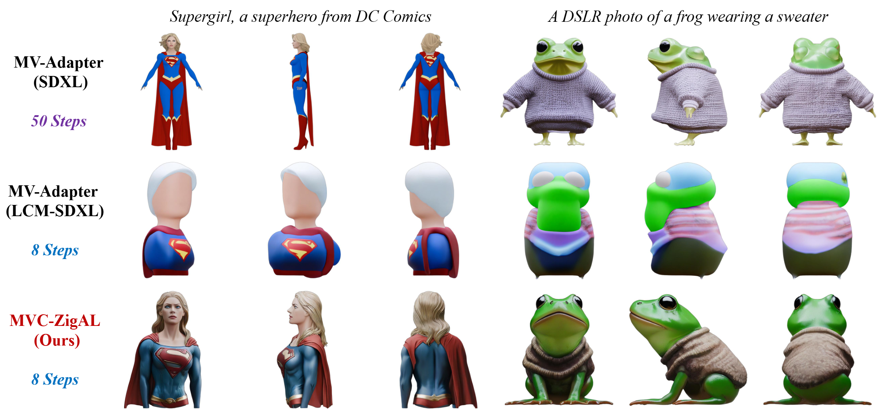

# Refining Few-Step Text-to-Multiview Diffusion via Reinforcement Learning

<div align="left">
  <a href="#" target="_blank"></a>
  <a href="https://arxiv.org/pdf/2505.20107" target="_blank"></a>
  <a href="https://drive.google.com/file/d/1KTNNFPBrOAvwbz_5w0ufFMoooigmt3vL/view?usp=drive_link"  target="_blank"></a>
  <a href="#" target="_blank"></a>
</div>

This repository contains a PyTorch implementation of **MVC-ZigAL**, as presented in our paper [*Refining Few-Step Text-to-Multiview Diffusion via Reinforcement Learning*](https://arxiv.org/abs/2505.20107).

## 🔥 News

- **[2026.02]** Our paper has been accepted to **CVPR 2026** 🎉🎉🎉

## 📖 Introduction

> Text-to-multiview (T2MV) diffusion models have shown great promise in generating multiple views of a scene from a single text prompt. While few-step backbones enable real-time T2MV generation, they often compromise key aspects of generation quality, such as per-view fidelity and cross-view consistency. Reinforcement learning (RL) finetuning offers a potential solution, yet existing approaches designed for single-image diffusion do not readily extend to the few-step T2MV setting, as they neglect cross-view coordination and suffer from weak learning signals in few-step regimes. To address this, we propose MVC-ZigAL, a tailored RL finetuning framework for few-step T2MV diffusion models. Specifically, its core insights are: (1) a new MDP formulation that jointly models all generated views and assesses their collective quality via a joint-view reward; (2) a novel advantage learning strategy that exploits the performance gains of a self-refinement sampling scheme over standard sampling, yielding stronger learning signals for effective RL finetuning; and (3) a unified RL framework that extends advantage learning with a Lagrangian dual formulation for multiview-constrained optimization, balancing single-view and joint-view objectives through adaptive primal-dual updates under a self-paced threshold curriculum that harmonizes exploration and constraint enforcement. Collectively, these designs enable robust and balanced RL finetuning for few-step T2MV diffusion models, yielding substantial gains in both per-view fidelity and cross-view consistency.



## 📦 Installation

To set up this repository, clone it, create a new conda environment, and install all dependencies within it:

```bash
# Clone this repository
git clone https://github.com/ZiyiZhang27/MVC-ZigAL.git
cd MVC-ZigAL

# Create and activate a new conda environment (Python 3.10+)
conda create -n mvczigal python=3.10 -y
conda activate mvczigal

# Install PyTorch with the appropriate CUDA version (we tested with CUDA 11.8)
pip install torch==2.6.0 torchvision==0.21.0 --index-url https://download.pytorch.org/whl/cu118

# Install the remaining dependencies
pip install -e .
```

💡 **NOTE:** To faithfully reproduce our results, we recommend using `CUDA 11.8` with NVIDIA RTX 4090 GPUs, along with `torch==2.6.0` and `torchvision==0.21.0`. Other setups might also work, but have not been extensively tested.

## 🚀 Training

Since our reward function is based on the HyperScore model from the [MATE-3D](https://github.com/zhangyujie-1998/MATE-3D) codebase, **please first download its checkpoint from [OneDrive](https://1drv.ms/u/c/669676c02328fc1b/EbUs_rWDXtREoXW_brOk_bkBzdFM6hyxFUoevRhRj1Zxmw?e=l4gIgs) and place it in the `mate3d/checkpoint` directory**. Then, you can launch the training script with:

```bash
CUDA_VISIBLE_DEVICES=0,1,2,3 accelerate launch scripts/train.py
```

Checkpoints will be automatically saved to the `logs/` directory, and training logs will be available on your Weights & Biases dashboard (configured during your first run).

💡 **NOTE:** Training hyperparameters are pre‑configured in `mvczigal/configs/` for a 4‑GPU setup (with 24 GB memory each). If you have additional GPU memory available, increase `sample_batch_size_per_gpu` and `train_batch_size_per_gpu` while proportionally reducing `gradient_accumulation_steps`; you can also disable gradient checkpointing (`gradient_checkpointing: false`) if desired.

## ❄️ Inference

Once training is complete—or if you prefer to **use our trained LoRA checkpoint (available for download on [Google Drive](https://drive.google.com/file/d/1KTNNFPBrOAvwbz_5w0ufFMoooigmt3vL/view?usp=drive_link))**—you can generate multiview images from text prompts with:

```
python scripts/inference.py \
    --text "A DSLR photo of a frog wearing a sweater" \
    --seed 42 \
    --num_inference_steps 8 \
    --lora_model "checkpoint/mvczigal_lcm_sdxl_lora.safetensors" \
    --output "output.png"
```

⚙️ **Arguments:**

- `--text`: The input text prompt describing the scene to generate.
- `--seed`: Random seed.
- `--num_inference_steps`: Number of inference steps (default: 8).
- `--lora_model`: Path to the trained LoRA checkpoint. **If using your own trained checkpoint, replace with `logs/xxxxx/epoch_99/mvczigal_lcm_sdxl_lora.safetensors`**, where `xxxxx` corresponds to your specific training run name.
- `--output`: Output file path and name for the generated image (with views combined in a single row).

## 📝 Citation

If you find this work useful in your research, please consider citing our paper:

```bibtex
@inproceedings{zhang2026refining,
  title={Refining Few-Step Text-to-Multiview Diffusion via Reinforcement Learning},
  author={Ziyi Zhang and Li Shen and Deheng Ye and Yong Luo and Huangxuan Zhao and Meng Liu and Wei Yu and Lefei Zhang},
  booktitle={Proceedings of the IEEE/CVF Conference on Computer Vision and Pattern Recognition},
  year={2026}
}
```

## 🙏 Acknowledgements

- This repository builds upon [MV-Adapter](https://github.com/huanngzh/MV-Adapter) and [RLCM](https://github.com/Owen-Oertell/rlcm). We thank the respective authors for their valuable contributions.
- We also make use of code and pretrained models from [MATE-3D](https://github.com/zhangyujie-1998/MATE-3D), [PickScore](https://github.com/yuvalkirstain/PickScore), [HPSv2](https://github.com/tgxs002/HPSv2), and [ImageReward](https://github.com/THUDM/ImageReward). We thank the respective developers for making their resources publicly available.
- Special thanks to [Zigzag-Diffusion-Sampling](https://github.com/xie-lab-ml/Zigzag-Diffusion-Sampling) for releasing their inference code, which informed our ZMV-Sampling implementation.