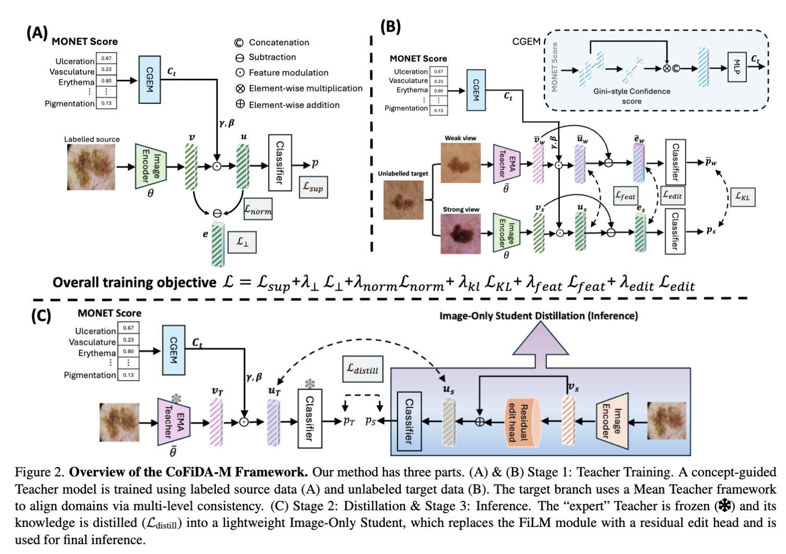

# CVPR'26 Main Track
### This is a multimodal framework for skin lesion analysis designed for domain adaptation, while supporting image-only inference at test time.

## @ Denver, Colorado, United States on 6th June 2026


# CoFiDA-M: Concept-Aware Feature Modulation for Cross-Domain Adaptation with Image-Only Inference 
### Authors: Nurjahan Sultana, Moi Hoon Yap, Xinqi Fan, and Wenqi Lu
## Paper Link: (https://openaccess.thecvf.com/content/CVPR2026/html/Sultana_CoFiDA-M_Concept-Aware_Feature_Modulation_for_Cross-Domain_Adaptation_with_Image-Only_Inference_CVPR_2026_paper.html)

## CoFiDA-M Architecture


## Abstract
Models for AI-based skin cancer screening suffer a severe performance drop when shifting from expert dermoscopic (source) images to consumer-grade clinical (target) images, hindering real-world deployment. Existing domain adaptation methods often ignore crucial semantic invariants, such as clinical concepts. While new foundation models like MONET can provide this semantic information as dense, probabilistic scores, this metadata is unavailable at test time, creating a deployment paradox for practical image-only screening tools. We address this gap by proposing CoFiDA-M, a privileged information framework that learns from concepts at training time but deploys as an image-only model. Our method trains a teacher network that uses MONET concept probabilities to guide a FiLM modulator, transforming visual features into a semantically "edited" feature space. A lightweight, image-only student is then trained to reproduce this edited representation, not just the teacher's final predictions. This distillation "bakes" the clinical reasoning into the student's weights. On a challenging multi-dataset benchmark, our image-only student significantly outperforms state-of-the-art approaches, especially in melanoma recall. Our work provides a practical and generalizable framework for leveraging noisy, probabilistic metadata as privileged information, demonstrating strong cross-dataset robustness and potential for real-world deployment beyond dermatology.

## Problem and Proposed Solution
<p align="center">
  
</p>

## Dataset
This work was evaluated on eight public skin lesion datasets for binary classification between melanoma and other lesions.

## Dataset Links

* [MILK10K dermoscopic](https://api.isic-archive.com/doi/milk10k/)
* [MILK10K clinical](https://api.isic-archive.com/doi/milk10k/)
* [Derm7pt dermoscopic](https://derm.cs.sfu.ca/Welcome.html)
* [Derm7pt clinical](https://derm.cs.sfu.ca/Welcome.html)
* [MIDAS dermoscopic](https://aimi.stanford.edu/datasets/mra-midas-Multimodal-Image-Dataset-for-AI-based-Skin-Cancer)
* [MIDAS clinical](https://aimi.stanford.edu/datasets/mra-midas-Multimodal-Image-Dataset-for-AI-based-Skin-Cancer)
* [HAM10000](https://www.nature.com/articles/sdata2018161)
* [Fitzpatrick17k](https://github.com/mattgroh/fitzpatrick17k)

## Evaluation
* AUROC (main)
* Melanoma recall (main)
* Balanced accuracy (supp)

## Figures
* Ablation on teacher knowledge: training loss, performance, and feature separation (main)
* CoFiDA-M qualitative validation with four subplots (main)
* Extended balanced accuracy analysis (supp)
* Ablation on MONET concept subsets (supp)
* Distillation alignment weight analysis (supp)
* Confidence gap comparison (supp)
* Inference speed comparison (supp)
* t-SNE of image only student features (supp)
* Feature editing maps with Grad-CAM (supp)
* Feature space transformation analysis (supp)
* MONET concept influence visualisation (supp)
* Attention distribution analysis (supp)

# CoFiDA-M Project (How to run)

Stage 1: Train the `CoFIDA + MONET` teacher on labeled dermoscopic source data with unlabeled clinical target adaptation.
Stage 2: Distill that teacher into an image-only student.
Stage 3: Evaluate the student on image-only inference.

## Project Layout

```text
CoFiDA/
├── pyproject.toml
├── requirements.txt
├── README.md
├── scripts/
│   ├── train_teacher.py
│   ├── eval_teacher.py
│   ├── train_student.py
│   ├── eval_student.py
│   └── export_student_split.py
└── src/
    └── cofida/
        ├── __init__.py
        ├── checkpointing.py
        ├── cli.py
        ├── data.py
        ├── evaluate.py
        ├── metrics.py
        ├── models.py
        ├── student.py
        ├── teacher.py
        └── utils.py
```

## Install

```bash
cd CoFiDA
python -m venv .venv
source .venv/bin/activate
pip install -r requirements.txt
pip install -e .
```

## Quick Start

Run the full project in this order:

1. Train the teacher with `scripts/train_teacher.py`
2. Evaluate the teacher with `scripts/eval_teacher.py`
3. Train the student with `scripts/train_student.py`
4. Optionally export the student split with `scripts/export_student_split.py`
5. Evaluate the student with `scripts/eval_student.py`

If you want to see the command format quickly, open any file in `scripts/` because each script now includes a short run example at the top.

## Expected Dataset Layout

The training and evaluation scripts assume image folders like:

```text
dataset_root/
├── mel/
│   ├── image1.jpg
│   └── ...
└── other/
    ├── image2.jpg
    └── ...
```

For MIDAS-style evaluation, `eval_student.py` also supports multi-class folders and automatically maps any class name containing `mel` to melanoma and everything else to `other`.

## Stage 1: Train Teacher

```bash
python scripts/train_teacher.py \
  --source-dir /path/to/dermoscopic/train/images \
  --target-dir /path/to/clinical/train/images \
  --target-val-dir /path/to/clinical/val/images \
  --monet-csv /path/to/MONET_metadata.csv \
  --save-dir outputs/teacher
```

Useful optional flags:

```bash
python scripts/train_teacher.py --help
```

## Stage 1: Evaluate Teacher

```bash
python scripts/eval_teacher.py \
  --test-dir /path/to/clinical/val/images \
  --monet-csv /path/to/MONET_metadata.csv \
  --checkpoint outputs/teacher/best_cofida_monet.pt \
  --out-csv outputs/teacher/clinical_val_predictions.csv
```

## Stage 2: Train Student

```bash
python scripts/train_student.py \
  --teacher-checkpoint outputs/teacher/best_cofida_monet.pt \
  --target-dir /path/to/clinical/train/images \
  --monet-csv /path/to/MONET_metadata.csv \
  --save-dir outputs/student
```

Useful optional flags:

```bash
python scripts/train_student.py --help
```

## Optional: Export the Student Train/Val Split

```bash
python scripts/export_student_split.py \
  --target-dir /path/to/clinical/train/images \
  --monet-csv /path/to/MONET_metadata.csv \
  --output-dir outputs/student
```

## Stage 2: Evaluate Student

Binary `mel/other` layout:

```bash
python scripts/eval_student.py \
  --test-dir /path/to/clinical/val/images \
  --checkpoint outputs/student/best_student.pt \
```

MIDAS-style multi-class layout:

```bash
python scripts/eval_student.py \
  --test-dir /path/to/midas/images/clinical \
  --checkpoint outputs/student/best_student.pt \
  --auto-map-melanoma
```


### 📚 Citation

If you use any of the concepts or code from this repository, please consider citing our paper:

```bibtex
@InProceedings{Sultana_2026_CVPR,
    author    = {Sultana, Nurjahan and Yap, Moi Hoon and Fan, Xinqi and Lu, Wenqi},
    title     = {CoFiDA-M: Concept-Aware Feature Modulation for Cross-Domain Adaptation with Image-Only Inference},
    booktitle = {Proceedings of the IEEE/CVF Conference on Computer Vision and Pattern Recognition (CVPR)},
    month     = {June},
    year      = {2026},
    pages     = {15060-15069}
}
```
### YouTube Short Description
https://youtu.be/fD9SiGbGIxc?si=yxLKaVaMnPSyKsV8

## Contact

For questions or further discussion, please contact: nurjahan.sultana@stu.mmu.ac.uk
