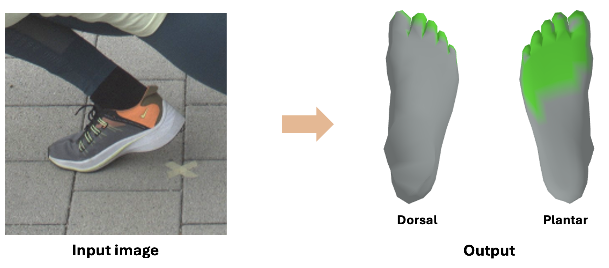

<div align="center">

# FECO: Shoe Style-Invariant and Ground-Aware Learning for Dense Foot Contact Estimation

<b>[Daniel Sungho Jung](https://dqj5182.github.io/)</b>, <b>[Kyoung Mu Lee](https://cv.snu.ac.kr/index.php/~kmlee/)</b> 

<p align="center">
    
</p>

<b>Seoul National University</b>

<a></a>
<a href="https://pytorch.org/get-started/locally/"></a>
[](https://creativecommons.org/licenses/by-nc/4.0/)
<a href='https://feco-release.github.io/'></a>
<a href="https://arxiv.org/pdf/2511.22184"></a>
<a href="https://arxiv.org/abs/2511.22184"></a>

<a href="https://huggingface.co/datasets/dqj5182/feco-checkpoints"></a> 
<a href="https://huggingface.co/papers/2511.22184"></a>


<h2>CVPR 2026</h2>



</div>

_**FECO** is a framework for **dense foot contact estimation** that addresses the challenges posed by **diverse shoe appearances** and **limited ground appearance variability** in foot images. Leveraging 10 datasets, including **our proposed in-the-wild dataset COFE**, we build a powerful model that learns dense foot contact across diverse scenarios._


## Code

## Installation
* We recommend you to use an [Anaconda](https://www.anaconda.com/) virtual environment. Install PyTorch >=1.13.1 and Python >= 3.8.0. Our latest FECO model is tested on Python 3.8.20, PyTorch 1.1e.1, CUDA 11.6.
* Setup the environment.
``` 
# Initialize conda environment
conda create -n feco python=3.8 -y
conda activate feco

# Install PyTorch
pip install torch==1.13.1+cu116 torchvision==0.14.1+cu116 torchaudio==0.13.1 --extra-index-url https://download.pytorch.org/whl/cu116

# Install all remaining packages
pip install -r requirements.txt
```

## Data
You need to follow our directory structure of the `data`.
* For quick demo: See [`docs/data_demo.md`](docs/data_demo.md).
* For evaluation: See [`docs/data_eval.md`](docs/data_eval.md).
* For training: See [`docs/data_train.md`](docs/data_train.md).

Then, download the official checkpoints and place them in the `release_checkpoint` from [HuggingFace](https://huggingface.co/datasets/dqj5182/feco-checkpoints/tree/main) by running:
```
bash scripts/download_feco_checkpoints.sh
```

## Quick demo (Image)
To run FECO on demo images using the [YOLO](https://docs.ultralytics.com/tasks/pose) human detector, please run:
```
python demo.py --backbone {BACKBONE_TYPE} --checkpoint {CKPT_PATH} --input_path {INPUT_PATH}
```

For example,
```
# ViT-H (ImageNet initialized) backbone
python demo.py --backbone vit-h-14 --checkpoint release_checkpoint/feco_final_vit_h_checkpoint.ckpt --input_path asset/example_images

# ViT-B (ImageNet initialized) backbone
python demo.py --backbone vit-b-16 --checkpoint release_checkpoint/feco_final_vit_b_checkpoint.ckpt --input_path asset/example_images
```


## Running FECO
### Train
To train FECO, please run:
```
python train.py --backbone {BACKBONE_TYPE}
```

For example,
```
# ViT-H (ImageNet initialized) backbone
python train.py --backbone vit-h-14

# ViT-B (ImageNet initialized) backbone
python train.py --backbone vit-b-16
```

### Test
To evaluate FECO, please run:
```
python test.py --backbone {BACKBONE_TYPE} --checkpoint {CKPT_PATH} --test_name {DATASET_NAME}
```

For example,
```
# ViT-H (ImageNet initialized) backbone on MMVP dataset
python test.py --backbone vit-h-14 --checkpoint release_checkpoint/feco_final_vit_h_checkpoint.ckpt --test_name MMVP

# ViT-H (ImageNet initialized) backbone on COFE dataset
python test.py --backbone vit-h-14 --checkpoint release_checkpoint/feco_final_vit_h_checkpoint.ckpt --test_name InstaVariety
```


## Technical Q&A
* `ImportError: cannot import name 'bool' from 'numpy'`: Please just comment out the line `from numpy import bool, int, float, complex, object, unicode, str, nan, inf`.
* `np.int was a deprecated alias for the builtin int. To avoid this error in existing code, use int by itself. Doing this will not modify any behavior and is safe. When replacing np.int, you may wish to use e.g. np.int64 or np.int32 to specify the precision. If you wish to review your current use, check the release note link for additional information`: Please refer to [here](https://github.com/scikit-optimize/scikit-optimize/issues/1171).


## Acknowledgement
We thank:
* [SagNets](https://openaccess.thecvf.com/content/CVPR2021/papers/Nam_Reducing_Domain_Gap_by_Reducing_Style_Bias_CVPR_2021_paper.pdf) for inspiration on Shoe Style-Content Randomization.
* [Pro-RandConv](https://openaccess.thecvf.com/content/CVPR2023/papers/Choi_Progressive_Random_Convolutions_for_Single_Domain_Generalization_CVPR_2023_paper.pdf) for inspiration on Low-Level Style Randomization.
* [DECO](https://openaccess.thecvf.com/content/ICCV2023/papers/Tripathi_DECO_Dense_Estimation_of_3D_Human-Scene_Contact_In_The_Wild_ICCV_2023_paper.pdf) for human-scene contact estimation.
* [HACO](https://openreview.net/pdf/675470edc47b66903daee2c8f60bd0f3fa8065f0.pdf) for dense contact estimation.


## Reference
```  
@inproceedings{jung2026feco,
    title={Shoe Style-Invariant and Ground-Aware Learning for Dense Foot Contact Estimation},
    author={Jung, Daniel Sungho and Lee, Kyoung Mu},
    booktitle={Proceedings of the IEEE/CVF Conference on Computer Vision and Pattern Recognition},
    year={2026}
}
```