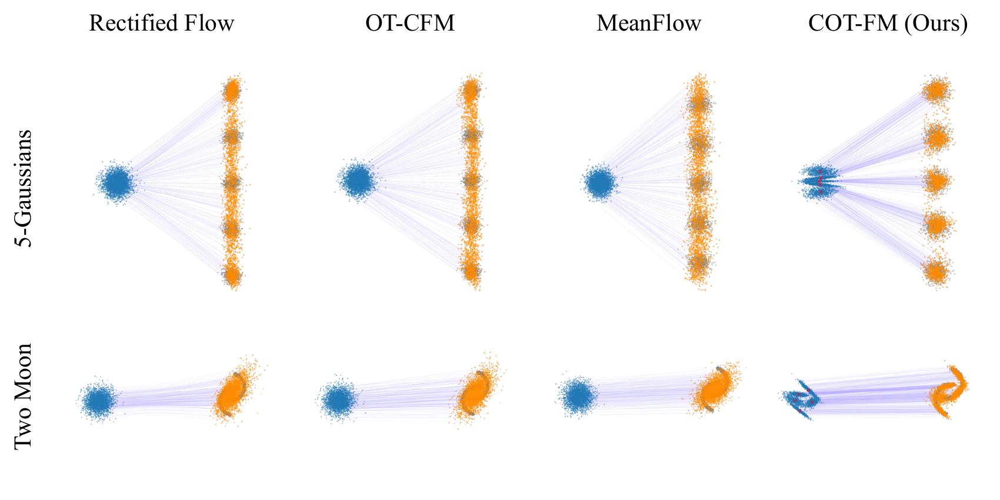

# COT-FM: Cluster-wise Optimal Transport Flow Matching



**🎉 Accepted to CVPR 2026.**

Official implementation of "COT-FM: Cluster-wise Optimal Transport Flow Matching".

COT-FM is a plug-and-play framework that reshapes the Flow Matching probability path by clustering target samples and assigning each cluster a dedicated source distribution. The result: straighter trajectories, lower discretization error, and faster sampling — without any architectural changes.

## Paper
- arXiv: [2603.13395](https://arxiv.org/abs/2603.13395)
- Project page: [embodiedai-ntu.github.io/cotfm](https://embodiedai-ntu.github.io/cotfm)

## Experiments

| Experiment | Dataset | Folder | Train | Eval |
|---|---|---|---|---|
| Unconditional 2D point cloud (§4.1, Table 1) | 5-Gaussians / Two Moons / Checkerboard | [`toy_2d`](toy_2d) | [`main.py`](toy_2d/main.py) | [`main.py`](toy_2d/main.py) |
| Unconditional image gen, Rectified Flow (§4.2, Table 2) | CIFAR-10 | [`cifar_rf`](cifar_rf) | [`main.py`](cifar_rf/main.py) | [`main.py`](cifar_rf/main.py) |
| Unconditional image gen, OT-CFM (§4.2, Table 2) | CIFAR-10 | [`cifar_otcfm`](cifar_otcfm) | [`train_cifar10.py`](cifar_otcfm/train_cifar10.py) | [`compute_fid_multi_gpu.py`](cifar_otcfm/compute_fid_multi_gpu.py) |
| Unconditional image gen, MeanFlow (§4.2, Table 2) | CIFAR-10 | [`cifar_meanflow`](cifar_meanflow) | [`train.py`](cifar_meanflow/train.py) | [`train.py`](cifar_meanflow/train.py) |
| Conditional image gen (§4.3, Table 3) | ImageNet 256×256 (SiT-B/2, SiT-B/4) | [`imagenet`](imagenet) | [`train_cotfm.py`](imagenet/train_cotfm.py) | [`evaluate.py`](imagenet/evaluate.py) |

`cifar_rf` selects train/eval via `--mode {train,eval}`; `cifar_meanflow` evaluates with `--eval_only` (see [`scripts/`](cifar_meanflow/scripts)); `toy_2d` runs training, sampling, and metrics from a single `main.py`. Each folder has its own README with setup and run instructions.

## Checkpoints

Released on [Google Drive](https://drive.google.com/drive/folders/1Jy7bhbI6LtwehKNY8tCx3OY1HNS6xcuO?usp=sharing):

| File | Folder | Backbone |
|---|---|---|
| `cotfm_rf.pth` | [`cifar_rf`](cifar_rf) | Rectified Flow, CIFAR-10 |
| `cotfm_otcfm.pt` | [`cifar_otcfm`](cifar_otcfm) | OT-CFM, CIFAR-10 |
| `cotfm_meanflow.pth` | [`cifar_meanflow`](cifar_meanflow) | MeanFlow, CIFAR-10 |
| `cotfm_imagenet_b_2.pt` | [`imagenet`](imagenet) | SiT-B/2, ImageNet 256×256 |
| `cotfm_imagenet_b_4.pt` | [`imagenet`](imagenet) | SiT-B/4, ImageNet 256×256 |

## Citation

```bibtex
@misc{chiang2026cotfmclusterwiseoptimaltransport,
      title={COT-FM: Cluster-wise Optimal Transport Flow Matching}, 
      author={Chiensheng Chiang and Kuan-Hsun Tu and Jia-Wei Liao and Cheng-Fu Chou and Tsung-Wei Ke},
      year={2026},
      eprint={2603.13395},
      archivePrefix={arXiv},
      primaryClass={cs.CV},
      url={https://arxiv.org/abs/2603.13395}, 
}
```

## License

Released under [CC BY-NC 4.0](LICENSE) (non-commercial) — © 2026 Chiensheng Chiang, Kuan-Hsun Tu, Jia-Wei Liao, Cheng-Fu Chou, Tsung-Wei Ke (National Taiwan University).

Subfolders derived from upstream codebases keep their original `LICENSE` files; those upstream terms also apply to the corresponding code.
