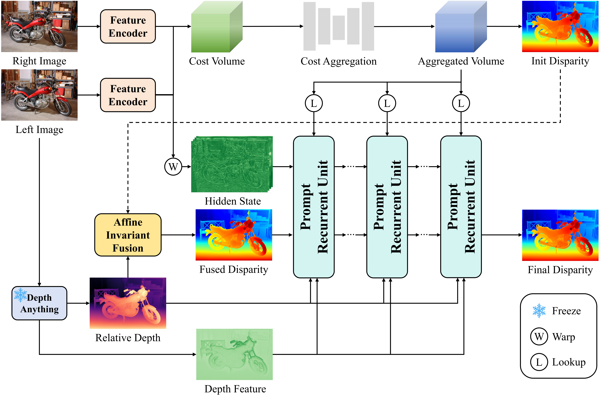

# 🏆 [CVPR 2026] PromptStereo: Zero-Shot Stereo Matching via Structure and Motion Prompts 🏆

Xianqi Wang, Hao Yang, Hangtian Wang, Junda Cheng, Gangwei Xu, Min Lin, Xin Yang

Huazhong University of Science and Technology, Optics Valley Laboratory

<a href='https://arxiv.org/abs/2603.01650'></a>



## 🔄 Update

* **05/14/2026:** Update demo and training code.
* **04/15/2026:** Update more versions of PromptStereo.
* **04/01/2026:** Update the evaluation code.

## ⚙️ Environment

```
conda create -n promptstereo python=3.12
conda activate promptstereo

pip install tqdm numpy wandb opt_einsum hydra-core
pip install imageio scipy torch torchvision opencv-python matplotlib
pip install xformers accelerate scikit-image
```

## 📂 Required Data

Data for evaluation:

* [KITTI 2012](https://www.cvlibs.net/datasets/kitti/eval_stereo_flow.php?benchmark=stereo)

* [KITTI 2015](https://www.cvlibs.net/datasets/kitti/eval_scene_flow.php?benchmark=stereo)

* [Middlebury](https://vision.middlebury.edu/stereo/submit3)

* [ETH3D](https://www.eth3d.net/datasets)

* [DrivingStereo](https://drivingstereo-dataset.github.io)

* [Booster](https://cvlab-unibo.github.io/booster-web/)

Data for training:

* [SceneFlow](https://lmb.informatik.uni-freiburg.de/resources/datasets/SceneFlowDatasets.en.html)

* [FoundationStereo Dataset](https://github.com/NVlabs/FoundationStereo)

* [TartanAir](https://github.com/castacks/tartanair_tools)

* [CREStereo Dataset](https://github.com/megvii-research/CREStereo)

* [FallingThings](https://research.nvidia.com/publication/2018-06_falling-things-synthetic-dataset-3d-object-detection-and-pose-estimation)

## 🎁 Pre-Trained Model

| Model | Link |
| :-: | :-: |
| Depth-Anything-V2-Large | [Download 🤗](https://huggingface.co/depth-anything/Depth-Anything-V2-Large/resolve/main/depth_anything_v2_vitl.pth?download=true) |
| PromptStereo-SceneFlow-192 | [Download 🤗](https://huggingface.co/Windsrain/PromptStereo/tree/main) |
| PromptStereo-Unlimited-192 | [Download 🤗](https://huggingface.co/Windsrain/PromptStereo/tree/main) |
| PromptStereo-SceneFlow-576 | [Download 🤗](https://huggingface.co/Windsrain/PromptStereo/tree/main) |
| PromptStereo-Unlimited-576 | [Download 🤗](https://huggingface.co/Windsrain/PromptStereo/tree/main) |

The SceneFlow checkpoint is retrained and obtains better performance than the paper's version.

## 🎥 Demo

```
accelerate launch save_disparity.py
```

## 📊 Evaluation

```
accelerate launch evaluate_stereo.py
```

```
# To evaluate with large disparity
accelerate launch evaluate_stereo.py checkpoint=checkpoint/unlimited_576.safetensors model.instance.cfg.gwc_max_disp=576
```

Default settings use bf16 precision with faster speed but a very little performance degration, you can set **accelerator.mixed_precision** to **null** to obtain entire performance.

## 🚀 Training

```
# SceneFlow training
accelerate launch train_stereo.py
```

```
# Unlimited training
accelerate launch train_stereo.py --config-name train_unlimited checkpoint=checkpoint/sceneflow_192.safetensors
```

You should set **tracker.init_kwargs.wandb.entity** and **save_path**.

## 🙏 Acknowledgement

This project is based on [Depth Anything V2](https://github.com/DepthAnything/Depth-Anything-V2), and [MonSter](https://github.com/Junda24/MonSter). We thank the original authors for their excellent works.
