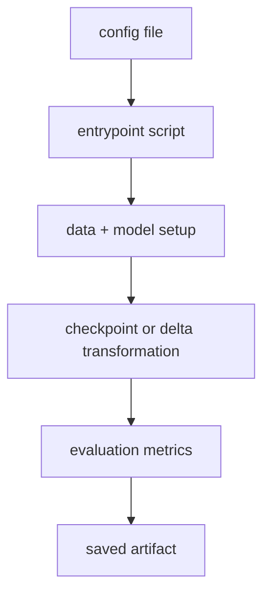
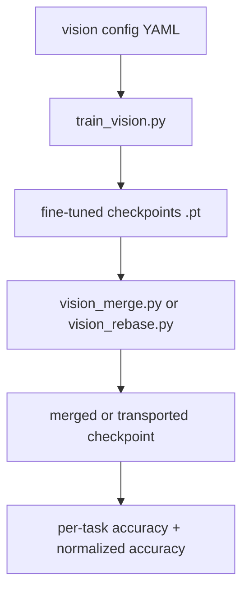

# **merge-and-rebase**
## Repo Tour

Research codebase for:

- OpenCLIP fine-tuning
- checkpoint merging
- task-vector transport / rebase
- vision + text evaluation

---

# **One-Sentence Summary**

This repo is a config-driven lab for:

1. training task-specific models,
2. turning them into deltas,
3. merging or transporting those deltas,
4. evaluating the result on shared suites.

---

# **The Big Mental Model**

Three verbs explain almost everything:

- `finetune/`: create task-specific checkpoints
- `merge/` and `rebase/`: transform updates
- `eval/`: run experiments and report metrics

If you keep those three buckets in mind, the folder structure makes sense quickly.

---

# **What `uv` Is**

`uv` is a fast Python packaging toolchain.

In practice, it combines the jobs people often split across:

- `python -m venv`
- `pip`
- lockfile management
- one-shot run commands

So in this repo, `uv` is the default way to create the environment and install the package.

---

# **`uv` Vs `conda`**

A useful mental model is:

- `conda` manages environments plus many non-Python binaries and system-style dependencies
- `uv` is focused on Python packaging, virtualenvs, and `pip`-style installs

So `uv` feels closer to:

- `venv` + `pip`, but faster and more integrated

---

# **When To Prefer `uv` Here**

`uv` is the better fit for this repo because the project already ships:

- `pyproject.toml`
- optional dependency groups
- `uv.lock`

That means the repo is already describing itself in standard Python packaging terms.

---

# **When People Still Use `conda`**

`conda` can still be a good choice when you need:

- non-Python libraries managed at the environment level
- a prebuilt CUDA / system dependency stack
- mixed-language scientific environments

But for this codebase, the happy path is still:

- create a normal virtualenv with `uv`
- install the repo in editable mode

---

# **`uv` Workflow Compared With `conda`**

`conda` style:

```bash
conda create -n merge-rebase python=3.12
conda activate merge-rebase
pip install -e ".[dev,data,test]"
```

`uv` style:

```bash
uv venv .venv
source .venv/bin/activate
uv pip install -e ".[dev,data,test]"
```

---

# **Useful `uv` Commands**

```bash
uv venv .venv
uv pip install -e .
uv pip install -e ".[data]"
uv pip install -e ".[dev,data,test]"
uv run pytest
uv run ruff check .
```

The repo mostly uses `uv` for install and then regular `python -m ...` entrypoints.

---

# **Install: Minimal**

```bash
uv venv .venv
source .venv/bin/activate
uv pip install -e .
```

Use this if you only want the base package and code imports.

---

# **Install: For Real Experiments**

```bash
uv pip install -e ".[data]"
```

Use `.[data]` when you want:

- Hugging Face datasets
- PIL image support
- normal train/eval data pipelines

---

# **Install: Dev Mode**

```bash
uv pip install -e ".[dev,data,test]"
```

Use this if you also want:

- `ruff`
- `pytest`
- the full repo workflow

---

# **What Editable Install Means**

`uv pip install -e .` means:

- Python imports resolve to `src/merge_and_rebase/`
- you can edit code without reinstalling
- good for iterative research work

Example:

- edit `src/merge_and_rebase/eval/vision_merge.py`
- rerun the command immediately

---

# **Top-Level Layout**

Important paths:

- `src/merge_and_rebase/`: actual package code
- `configs/`: ready-made JSON experiment configs
- `docs/`: the slides and docs artifacts
- `tests/`: regression tests
- `scripts/`: small helper scripts
- `README.md`: quickstart

---

# **Main Entrypoints**

```bash
python -m merge_and_rebase.finetune.train_vision
python -m merge_and_rebase.finetune.train_text
python -m merge_and_rebase.eval.vision_merge
python -m merge_and_rebase.eval.vision_rebase
python -m merge_and_rebase.eval.vision_connectivity
python -m merge_and_rebase.eval.llm_merge
```

These are the commands people usually run, not library calls.

---

# **Typical Repo Flow**



That same pattern appears in vision, text, merge, and rebase.

---

# **End-to-End Vision Story**

A common workflow looks like this:

1. fine-tune one checkpoint per task
2. load those checkpoints together
3. convert them into task vectors
4. merge them with a chosen method
5. evaluate the merged model on the suite

---

# **Flow Diagram**



---

# **Fine-Tuning Example Command**

```bash
python -m merge_and_rebase.finetune.train_vision \
  --vision-config src/merge_and_rebase/finetune/configs/vision.yaml \
  --suite vision8
```

What this means:

- use the vision config preset
- pick the `vision8` dataset suite
- train one task at a time in the configured order

---

# **Fine-Tuning Code Path**

Small version of what `train_vision.py` does:

```python
cfg_file = _load_config(args.vision_config)
tasks = resolve_tasks(args, cfg_file)

for task in tasks:
    summary = train_task(
        task=task,
        build_cfg=build_cfg,
        strategy=strategy,
        ...,
    )
```

This is why the repo feels config-driven: the outer script mostly resolves config, then loops through tasks.

---

# **What `train_vision.py` Does**

Per task, it roughly does:

1. resolve config
2. load the HF dataset
3. build OpenCLIP
4. build zero-shot text features
5. choose a training strategy
6. train and validate
7. save checkpoint + JSON summary

---

# **Vision Config Shape**

The config style is:

```yaml
common:
  backbone: ...
  train: ...
  strategy: ...
  output: ...

datasets:
  CIFAR10:
    train:
      epochs: 10
```

So there is a shared default block plus per-dataset overrides.

---

# **Vision Config Example**

```yaml
common:
  backbone:
    clip_model: ViT-B-32
    clip_pretrained: openai
  strategy:
    name: full
  train:
    lr: 1e-4
    epochs: 5
```

This is the default experiment template that `train_vision.py` expands task by task.

---

# **Vision Strategies**

Built-in vision strategies:

- `full`: train all parameters
- `linear_probe`: train only the classification head
- `peft_lora`: LoRA on the OpenCLIP visual backbone

---

# **Strategy Example**

```yaml
strategy:
  name: peft_lora
  forward_mode: linearized_ntk
  peft:
    r: 16
    lora_alpha: 16
    target_modules: [q_proj, k_proj, v_proj, out_proj]
```

This tells the repo to fine-tune only low-rank adapters on selected visual modules while training in the linearized NTK regime.

---

# **Text Pre-Stages**

`train_vision.py` can optionally tune the text side before vision training.

Options:

- `text_embeddings_finetune`
- `text_prompt_tuning`

Purpose:

- adapt zero-shot text features before tuning the image encoder

---

# **Text Pre-Stage Example**

```yaml
strategy:
  name: full
  text_prompt_tuning:
    enabled: true
    context_length: 16
    epochs: 1
```

This is the CoOp-style route: learn prompt context vectors first, then run the main vision strategy.

---

# **What Gets Saved After Vision Training**

For each task, the repo saves:

- a checkpoint `.pt`
- a summary `.json`
- optionally a PEFT adapter directory

Typical checkpoint payload includes:

- backbone info
- metrics
- strategy name
- tuned text features when present

---

# **Example Output Layout**

```text
src/checkpoints/finetune/
  ViT-B-32/
    openai/
      CIFAR10/
        full_best_ep.pt
        full.json
```

This makes downstream merge runs easy because every task has a predictable checkpoint location.

---

# **From Checkpoint To Task Vector**

Core idea:

```text
task vector = tuned checkpoint - base checkpoint
```

In code, this logic lives in:

- `merge/task_vectors.py`

That file handles:

- filtering keys
- checking compatibility
- flattening / unflattening
- norms and masking

---

# **Tiny Task-Vector Example**

If a base weight is:

```text
W_base = [1.0, 2.0]
```

and a tuned weight is:

```text
W_tuned = [1.2, 1.7]
```

then the task vector is:

```text
D = W_tuned - W_base = [0.2, -0.3]
```

---

# **Task-Vector Code Snippet**

This is the actual API shape used in the repo:

```python
tv = TaskVector.from_checkpoints(base_sd, tuned_sd, strict=True)
delta = tv.delta
norm = tv.l2_norm()
```

So the merge code usually starts from checkpoint pairs, not handwritten tensors.

---

# **Merge Example Command**

```bash
python -m merge_and_rebase.eval.vision_merge \
  --config configs/vision8_task_arithmetic.json
```

This is the main vision merge entrypoint.

It expects a config that tells it:

- which base model to use
- which tuned checkpoints to load
- which merge method to apply

---

# **Merge Code Snippet**

The core pattern looks like this:

```python
method = get_method(cfg["method"])
prepared = method.prepare(
    base=base_sd,
    tuned=tuned_sds_list,
    weights=weights,
)
merged_sd = method.apply(prepared=prepared, alpha=alpha)
```

That `prepare -> apply` split is what makes alpha search cheap.

---

# **What `vision_merge.py` Does**

High level:

1. build the base OpenCLIP model
2. load tuned checkpoints
3. align keys to the base model
4. prepare the merge method
5. evaluate merged weights on each task

---

# **Merge Config Example**

```json
{
  "suite": "vision8",
  "method": "task_arithmetic",
  "alpha_search": true,
  "tuned_ckpts": {
    "CIFAR10": "...pt",
    "EuroSAT": "...pt"
  }
}
```

This is the kind of JSON that drives merge experiments.

---

# **Alpha Search**

Instead of assuming the merge scale should be `1.0`, the repo can scan a range.

Example:

```text
alpha in {0.0, 0.1, 0.2, ..., 2.0}
```

This is useful because many merge methods produce the best accuracy at a non-default scale.

---

# **Alpha Search Example**

Conceptually:

```text
merged(alpha) = base + alpha * merged_delta
```

Example outcomes:

- `alpha = 0.0`: just the base model
- `alpha = 1.0`: standard merge output
- `alpha = 1.4`: sometimes stronger transfer

---

# **Text Features In Vision Eval**

Vision eval has an important choice:

- use zero-shot prompt templates
- use tuned text features saved in checkpoints

Controlled by:

- `text_features_source = auto`
- `zero_shot`
- `tuned_ckpt`

---

# **Text Feature Example**

If a checkpoint contains tuned text features:

- `auto` uses them
- `tuned_ckpt` requires them
- `zero_shot` ignores them and rebuilds from templates

This matters because a merged vision model may pair better with either tuned or zero-shot text embeddings.

---

# **Merge Methods: Simple Family**

Methods that are easiest to explain first:

- `task_arithmetic`
- `weighted_average`
- `ties_merge`
- `dare_merge`

These mostly work directly on task deltas or aligned states.

---

# **Merge Methods: Matrix / SVD Family**

More structure-heavy methods:

- `tsv_merge`
- `isoc_merge`
- `isocts_merge`
- `cart_merge`
- `pcb_merge`

These are more research-oriented and often manipulate matrices or flattened deltas in a specific way.

---

# **Method Example: Task Arithmetic**

Task arithmetic is the simplest mental model:

```text
D_merge = w1 * D1 + w2 * D2 + ...
merged = base + D_merge
```

Good first method to read in code:

- `merge/methods/task_arithmetic.py`

---

# **Method Example: TIES**

TIES roughly does:

1. prune small entries
2. resolve signs across tasks
3. merge only sign-consistent entries

That makes it less naive than pure summation when task deltas conflict.

---

# **PEFT Checkpoints**

The repo also supports LoRA / PEFT checkpoints.

That means merge code sometimes works with:

- full state dicts
- PEFT adapter state
- PEFT adapter directories

Important helper files:

- `io/peft_helpers.py`
- `eval/merge_utils.py`
- `eval/utils.py`

---

# **PEFT Subspaces**

For PEFT merges, there are subspace options:

- `identity`
- `core`
- `knots`

These live in:

- `merge/subspaces/`

They project LoRA updates into a mergeable space, then lift them back.

---

# **Subspace Example Intuition**

Without a subspace, you can think in terms of merging raw adapter tensors.

With a subspace, you instead do:

```text
adapter updates -> project -> merge in low-rank space -> lift back
```

That is why `core_space.py` and `knots_space.py` matter.

---

# **Rebase Example Command**

```bash
python -m merge_and_rebase.eval.vision_rebase \
  --config configs/vision8_gradfix_rebase.json
```

This is for the case where you want to move a merged update from source base A onto target base B.

---

# **Rebase Code Snippet**

Conceptually, the rebase path looks like this:

```python
deltas = [TaskVector.from_checkpoints(source_base, tuned).delta for tuned in tuned_sds]
merged_delta = compose_weighted_deltas(deltas, weights)

transport = GradFixRebase()
prepared = transport.prepare(
    target_model=target_model,
    target_dataloader=grad_loader,
    recipe=clip_contrastive_recipe(...),
)
rebased_delta = transport.apply(prepared, delta=merged_delta)
```

The important idea is: merge first, then transport the merged delta.

---

# **What Rebase Means**

Normal merge says:

- combine updates around one base model

Rebase says:

- take an update defined around base A
- transport it so it can be applied to base B

That is the role of `rebase/`.

---

# **Rebase Mental Model**

```text
source base A
   + merged task vector D_merge
   -> transport(D_merge, A, B)
   -> D_transport
   -> target base B + D_transport
```

So the update moves, not just the raw checkpoint.

---

# **Built-In Rebase Methods**

- `identity`: no transport, just reuse the delta
- `orthogonal_shift`: remove the part aligned with `B - A`
- `gradfix`: compute gradient signs on the target side and mask the delta

---

# **GradFix In Plain English**

GradFix asks:

- when we evaluate on the target model, which parameter directions seem helpful?

Then it:

- computes gradient signs on target data
- compares those signs to the transported delta
- keeps or forces entries based on agreement

---

# **GradFix Example**

Imagine one transported delta entry is `-0.4`.

If GradFix says the target gradient sign prefers negative movement too:

- keep it in `normal` mode

If the signs disagree:

- zero it out in `normal`
- or flip/force it in `force`

---

# **Why `grad_recipes.py` Exists**

GradFix is model-agnostic.

So it needs model-specific recipes for:

- how to compute the loss
- which parameters to track

That is why the repo has:

- `clip_contrastive_recipe`
- `causal_lm_recipe`
- `seq_classification_recipe`

---

# **Forward Modes In Vision Eval**

Vision evaluation supports different forward modes:

- `standard`
- `linearized_ntk`

Defined in:

- `models/forward_modes.py`

This is one of the more research-specific features in the repo.

---

# **What `linearized_ntk` Means Here**

It replaces the normal forward pass with a first-order linearization around base weights.

In practice:

- useful when checkpoints were trained with `strategy.forward_mode: linearized_ntk`
- helps evaluation match the intended linearized training regime

Core helper:

- `utils/linearization.py`

---

# **Connectivity Experiments**

`eval/vision_connectivity.py` is for interpolation analysis.

Typical questions it answers:

- what happens along the line between checkpoint A and B?
- is there a barrier in accuracy or loss?
- what does the plane spanned by two deltas look like?

---

# **Text / LLM Side**

There is a parallel text track too.

Main files:

- `finetune/train_text.py`
- `data/text_loaders.py`
- `models/text_lm.py`
- `eval/llm_merge.py`

The main benchmark family here is NLI.

---

# **Text Training Example**

```bash
python -m merge_and_rebase.finetune.train_text \
  --text-config src/merge_and_rebase/finetune/configs/text-peft.yaml \
  --suite nli6
```

This trains sequence-classification models on the NLI task suite.

---

# **Text Training Code Path**

Small version of the text runner loop:

```python
cfg_file = _load_config(args.text_config)
tasks = resolve_tasks(args, cfg_file)

for task in tasks:
    summary, head = train_task(
        task=task,
        build_cfg=build_cfg,
        strategy=strategy,
        ...,
    )
```

It mirrors `train_vision.py`, but on tokenized NLI data and HF text models.

---

# **What `train_text.py` Does**

It roughly:

1. loads the HF text model
2. loads tokenized NLI data
3. applies a strategy
4. trains per task
5. saves checkpoints and extracted task heads

Supported text strategies:

- `full`
- `linear_probe`
- `peft_lora`

---

# **Text Merge Example**

```bash
python -m merge_and_rebase.eval.llm_merge \
  --config configs/llm_merge_llama3_8b_knots_hf.json
```

This is the text-side analogue of `vision_merge.py`, with extra logic for adapters and task heads.

---

# **Data Package**

`data/` is split cleanly:

- `vision_loaders.py`: HF image datasets, transforms, splits, classnames
- `templates.py`: zero-shot prompt templates
- `text_loaders.py`: NLI task specs, tokenization, loaders

Read these early if you want to understand what the experiments are actually feeding into the models.

---

# **Models Package**

`models/` is where the repo wraps backbone libraries.

Key files:

- `openclip_classifier.py`
- `text_lm.py`
- `grad_recipes.py`
- `patch_openclip_attention.py`
- `forward_modes.py`

This package is the interface between raw libraries and repo-specific experiments.

---

# **Finetune Package**

`finetune/` is where training policy lives.

Key ideas:

- config-driven task loops
- strategy registry
- optional text pre-stages
- regularizers
- checkpoint export formats

If you want to add a new training mode, start here.

---

# **Merge Package**

`merge/` is the math core.

Important files:

- `task_vectors.py`
- `base.py`
- `registry.py`
- `methods/`
- `subspaces/`

If you want to add a new merge algorithm, this is the package to study first.

---

# **Rebase Package**

`rebase/` is smaller but conceptually important.

It defines:

- the transport interface
- built-in transport methods
- GradFix utilities

If merge is “combine deltas,” rebase is “move deltas between coordinate systems.”

---

# **Eval Package**

`eval/` is the orchestration layer.

It contains:

- main experiment scripts
- shared CLI glue
- caching helpers
- reporting helpers
- PEFT materialization logic

This is where most full experiments come together.

---

# **IO + Utility Layer**

Small but critical helpers:

- `io/ckpt.py`: normalize and align checkpoints
- `io/peft_helpers.py`: detect/load PEFT formats
- `utils/helpers.py`: parse config inputs
- `utils/linearization.py`: JVP-based linearization

These files make the rest of the code less repetitive.

---

# **Configs + Tests + Scripts**

The repo is easier to learn if you use these as documentation:

- `configs/`: runnable examples
- `tests/`: edge cases and intended behavior
- `scripts/`: one-off utilities like checkpoint download helpers

Often the fastest way to learn a feature is to find its test first.

---

# **How The Registry Pattern Works**

This repo uses a lightweight plugin pattern.

The idea is:

1. define a protocol such as `MergeMethod` or `Strategy`
2. keep a global dictionary keyed by `name`
3. expose `register(...)`, `get_* (...)`, and `list_* (...)`
4. import implementation modules so they register themselves

That is how new components become visible to the entrypoints.

---

# **Registry Example: Merge Methods**

The merge registry is essentially:

```python
_METHODS: dict[str, MergeMethod] = {}

def register(method):
    _METHODS[method.name] = method

def get_method(name):
    return _METHODS[name]
```

Then each method module ends with something like:

```python
register(TaskArithmeticMerge())
```

---

# **Why This Design Is Nice**

Why use registries instead of giant `if/elif` trees?

- entrypoints stay small
- implementations live next to their own logic
- CLI/config can refer to components by name
- adding a component usually means adding one new file, not editing many call sites

---

# **Extension Points In This Repo**

The main plugin-style families are:

- merge methods
- rebase methods
- finetuning strategies
- PEFT subspaces
- regularizers

Each family has:

- a base protocol
- a registry file
- implementation modules that call `register(...)`

---

# **How Discovery Actually Happens**

The important trick is side-effect import.

Example:

- `merge/registry.py` imports `merge.methods`
- `merge.methods` imports the concrete method files
- each concrete file calls `register(...)`

So by the time `get_method(...)` is used, the registry has already been populated.

---

# **Side-Effect Import Example**

The pattern looks like this:

```python
# registry.py
from . import methods as _methods

# task_arithmetic.py
register(TaskArithmeticMerge())
```

The import is not used directly for values.
It exists so Python executes the module and triggers registration.

---

# **How To Add A Merge Method**

Steps:

1. create a file in `merge/methods/`
2. implement a class with a unique `name`
3. implement `merge(...)`, or better `prepare(...)` + `apply(...)`
4. call `register(YourMethod())`
5. make sure the module is imported by `merge/methods/__init__.py`

Then the method becomes usable from config and CLI.

---

# **Merge Method Template**

```python
from dataclasses import dataclass
from ..base import TensorDict
from ..registry import register

@dataclass(frozen=True)
class MyMerge:
    name: str = "my_merge"

    def merge(self, *, base: TensorDict, tuned, weights=None, **kwargs):
        ...

register(MyMerge())
```

If you support alpha search, add `prepare(...)` and `apply(...)` too.

---

# **When To Implement `prepare` And `apply`**

Use the prepared form when:

- one expensive computation can be reused
- `alpha` only rescales or recomposes the result

That is exactly why methods like task arithmetic fit the pattern well.

---

# **How To Add A Finetuning Strategy**

Steps:

1. create a file in `finetune/strategies/`
2. implement a class with `name`
3. implement `configure(...)`
4. set `requires_grad` for the right parameters
5. return `(optimizer, scheduler, info)`
6. call `register(YourStrategy())`
7. import the module from `finetune/strategies/__init__.py`

---

# **Strategy Template**

```python
from dataclasses import dataclass
from .registry import register

@dataclass(frozen=True)
class MyStrategy:
    name: str = "my_strategy"

    def configure(self, *, model, lr, weight_decay, device, **kwargs):
        # choose trainable params
        # build optimizer
        # build scheduler
        return opt, scheduler, {"trainable_params": n}

register(MyStrategy())
```

---

# **What `configure(...)` Is Responsible For**

A strategy owns training policy.

That usually means:

- which params are trainable
- whether forward is patched or wrapped
- optimizer choice
- scheduler choice
- reporting summary info

So if you add a strategy, think “training policy module,” not just “optimizer preset.”

---

# **How To Add A Regularizer**

Regularizers are a little different.

The extension point exists, but this repo currently ships:

- `regularizers/base.py`
- `regularizers/registry.py`

There are no built-in regularizer implementation files yet.

---

# **Regularizer Template**

A new regularizer would look like:

```python
from dataclasses import dataclass
from .registry import register

@dataclass(frozen=True)
class MyRegularizer:
    name: str = "my_regularizer"

    def prepare_model(self, *, model, device, regularization_cfg=None, **kwargs):
        pass

    def configure(self, *, model, device, regularization_cfg=None, **kwargs):
        def reg_fn(*, model, step, batch_index):
            return 0.0 * next(model.parameters()).sum()
        return reg_fn, {"extra_params": 0}

register(MyRegularizer())
```

---

# **One Nuance About Regularizers**

Because there is no `regularizers/__init__.py` importing built-ins yet, adding a new regularizer may also require an import hook so the module is actually executed.

In practice, you would likely add a small package import file similar to:

```python
from . import my_regularizer as _my_regularizer
```

or import the module explicitly from the training path.

---

# **How To Add A Rebase Method**

Steps:

1. create a file in `rebase/methods/`
2. implement `transport(...)`, or `prepare(...)` + `apply(...)`
3. give it a unique `name`
4. call `register(YourTransport())`
5. ensure `rebase/methods/__init__.py` imports it

---

# **Rebase Method Template**

```python
from dataclasses import dataclass
from ..registry import register

@dataclass(frozen=True)
class MyTransport:
    name: str = "my_transport"

    def transport(self, *, source_base, target_base, delta, **kwargs):
        return dict(delta)

register(MyTransport())
```

Use prepared state if transport needs expensive target-side setup.

---

# **How To Add A PEFT Subspace**

Steps:

1. create a file in `merge/subspaces/`
2. implement `prepare(...)`, `project(...)`, and `lift(...)`
3. give it a unique `name`
4. call `register(YourSpace())`
5. import it from `merge/subspaces/__init__.py`

This is the PEFT analogue of adding a merge method.

---

# **Subspace Template**

```python
from dataclasses import dataclass
from .registry import register

@dataclass(frozen=True)
class MySpace:
    name: str = "my_space"

    def prepare(self, *, lora_by_task, peft_cfg):
        ...

    def project(self, prepared, *, lora_by_task, peft_cfg):
        ...

    def lift(self, prepared, *, merged_core, lora_template, peft_cfg):
        ...

register(MySpace())
```

---

# **Checklist When Adding Any Component**

Whenever you add a new plugin-like component, check these five things:

1. unique `name`
2. correct protocol methods implemented
3. `register(...)` called
4. import path that triggers registration exists
5. config / CLI name matches the registered `name`

If one of these is missing, the component will not be discoverable.

---

# **Common Failure Modes**

Typical mistakes:

- forgot to call `register(...)`
- forgot to import the module for side effects
- reused an existing `name`
- implemented the wrong return shape
- config references the filename instead of the registered `name`

Those are exactly the kinds of issues the registry pattern makes easier to debug.

---

# **Best Files To Read First**

Recommended reading order:

1. `README.md`
2. `finetune/train_vision.py`
3. `eval/vision_merge.py`
4. `merge/task_vectors.py`
5. `rebase/methods/gradfix.py`
6. `models/openclip_classifier.py`

That gives you setup, training, merging, transport, and model wrapping in a manageable order.

---

# **Best Files For The Text Track**

If you care about the NLI / LLM path too, then read:

1. `finetune/train_text.py`
2. `eval/llm_merge.py`
3. `data/text_loaders.py`
4. `models/text_lm.py`

That is the shortest path to the text side of the repo.

---

# **Takeaway**

The repo is deep, but the architecture is consistent:

- configs describe experiments
- entrypoints assemble them
- loaders and wrappers build inputs/models
- merge/rebase transform updates
- eval reports outcomes

That repeatable pattern is what makes the codebase navigable.
