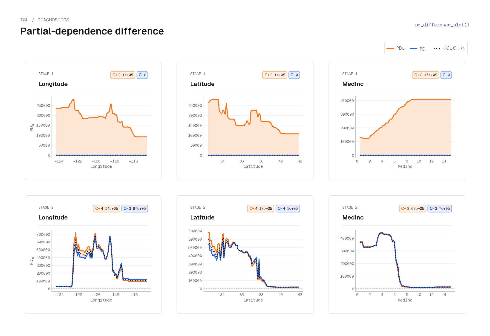
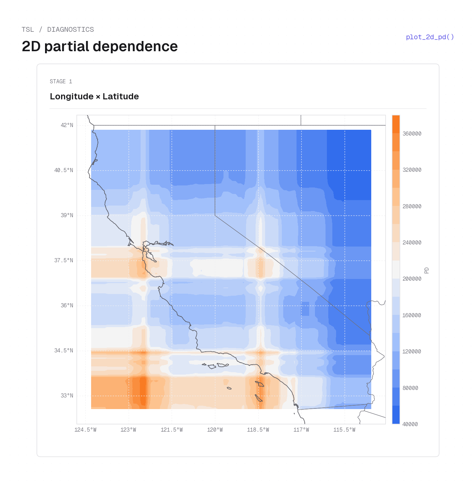
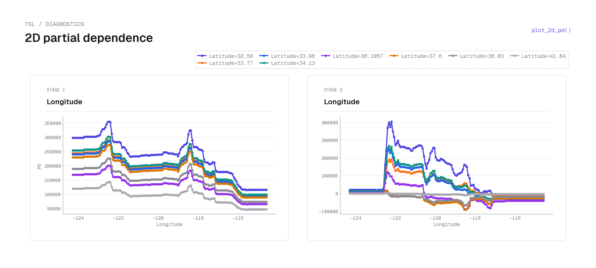
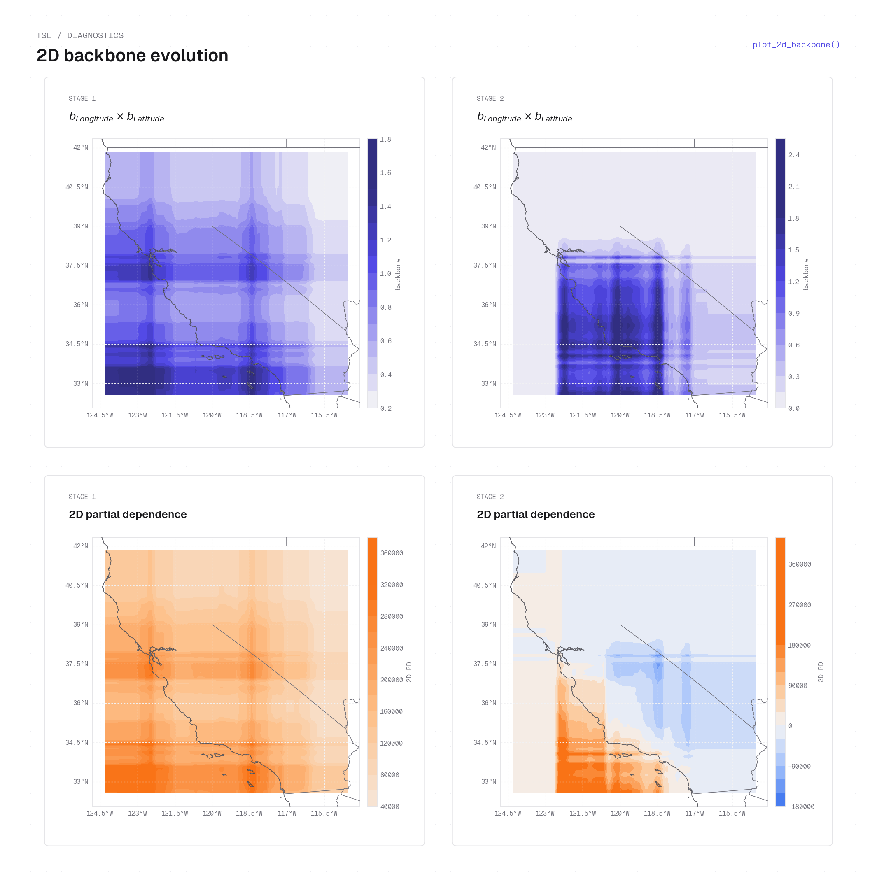
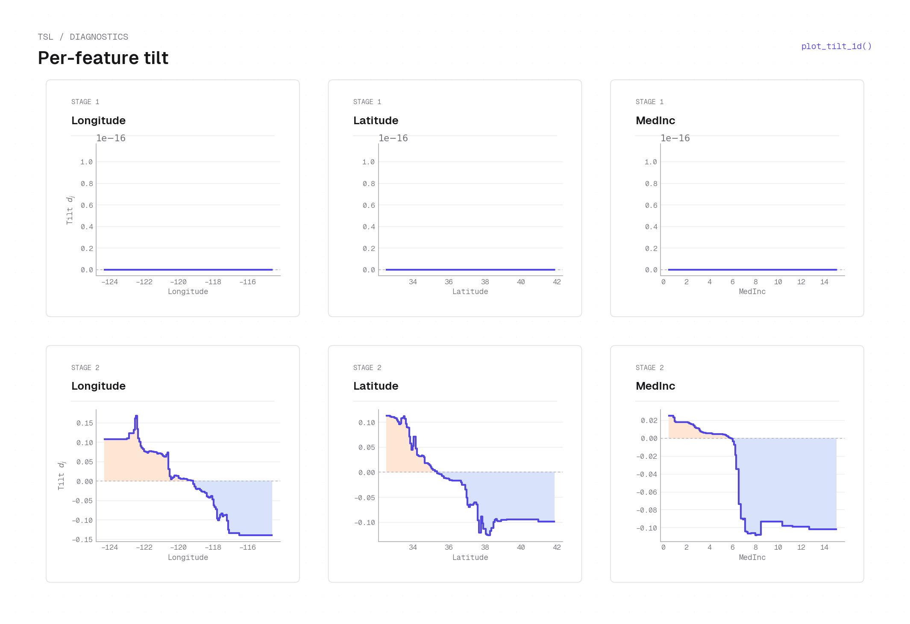
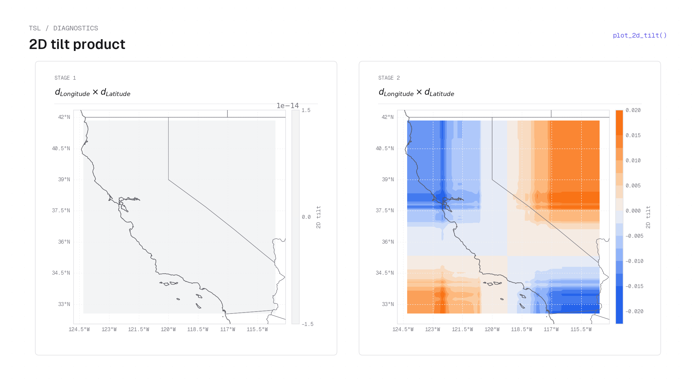
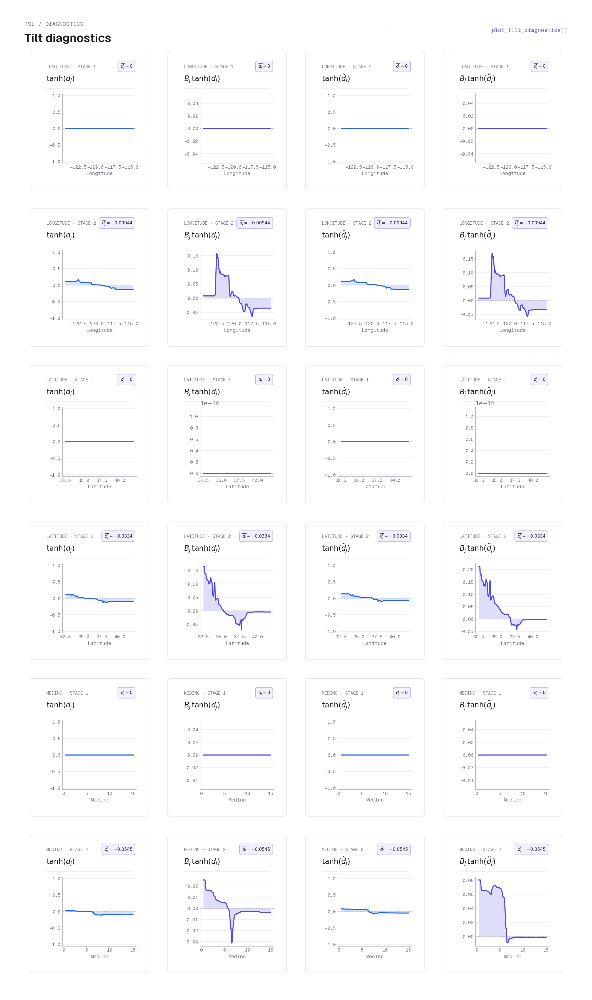
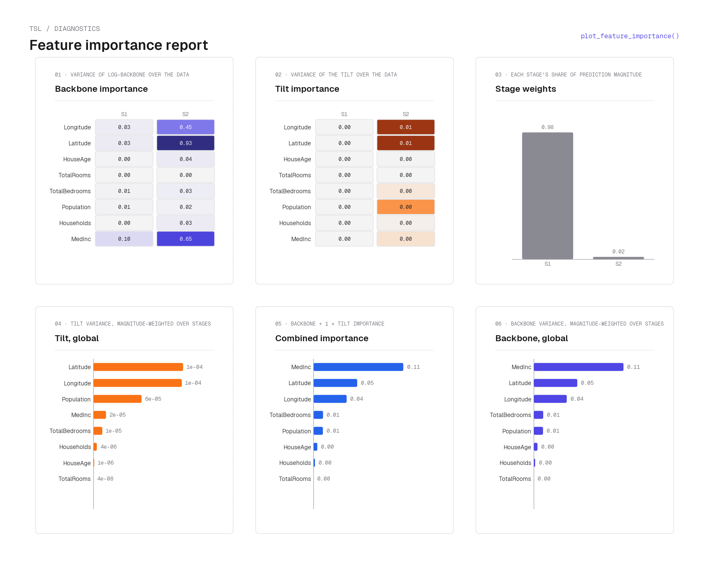
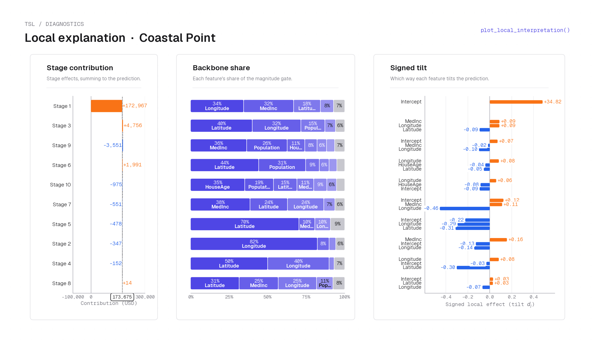
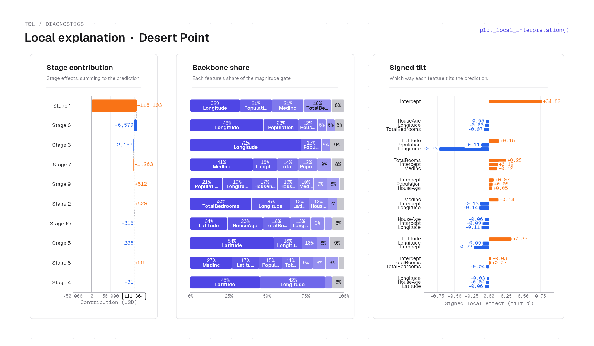

# Plotting (`tensorsl.plot`)

`tensorsl.plot` holds the diagnostic plots. It is **lazy-imported** (it needs `matplotlib`,
installed via the `[plots]` extra) so importing `tensorsl` stays light.

```python
import tensorsl.plot as tplot
```

!!! tip "Figure **and** data"
    Every helper returns a **result dataclass carrying the raw arrays** in addition to
    drawing the figure, so you can re-style, export, or rebuild a custom visualization.

### Common parameters

Most plotting functions share these; per-function tables below list only the distinctive
ones.

| Parameter | Type | Default | Description |
|------|------|:--:|-------------|
| `model` | `TSL` | _required_ | a fitted model (`TSLRegressor.core_estimator_`) |
| `X` | `ndarray (n_samples, n_features)` | _required_ | background data to marginalize over |
| `features` | `Iterable[int | str] | None` | `None` | features to plot (default: all) |
| `feature_x`, `feature_y` | `int | str` | _required_ | the two features for 2D plots |
| `feature_names` | `Sequence[str] | None` | `None` | names for labelling |
| `stages` | `Iterable[int] | None` | `None` | which stages to draw (default: all) |
| `grid_points` | `int` | `200`/`100`/`50` | evaluation resolution |
| `figsize` | `tuple[float, float] | None` | `None` | matplotlib figure size |

---

## Partial dependence & ICE

The model-native PD math these plots draw on is derived in [Partial dependence](../math/partial-dependence.md).

### `plot_first_order_pd` { #fn-plot-first-order-pd }

```python
plot_first_order_pd(model, X, features=None, feature_names=None, grid_points=200,
                    stages=None, figsize=None, pd_scale="raw",
                    show_data_density=False) -> PDDifferenceResult
```

First-order partial dependence — the $\hat{m}_+$ and $\hat{m}_-$ branch curves — per stage for the
selected features (one row per stage, one column per feature).

| Parameter | Type | Default | Description |
|------|------|:--:|-------------|
| `pd_scale` | `"raw" | ...` | `"raw"` | scaling applied to the PD curves |
| `show_data_density` | `bool` | `False` | overlay a data-density rug |

**Returns**

| Type | Description |
|------|-------------|
| `PDDifferenceResult` | figure plus the per-stage $\hat{m}_+$ and $\hat{m}_-$ branch curves and constants for the selected features. |

<figure markdown="span">
  { width="100%" }
  <figcaption markdown="span"><code>plot_first_order_pd</code> on California housing — the summed $\hat{m}_+$ branch PD for Latitude (left) and Longitude (right) overlaid against EBM, XGBoost (blackbox and interpretable), and SepALS baselines. TSL (dark blue) preserves sharp localized peaks — a spike near lat 37–38 (Bay Area) and a coastal concentration near lon −122 — while additive-marginalization baselines produce nearly monotone slopes. Faithfulness follows from separability: for a product-form model the 1D PD curve recovers the exact factor shape; see [Partial dependence](../math/partial-dependence.md) for the proof.</figcaption>
</figure>

### `pd_difference_plot` { #fn-pd-difference-plot }

```python
pd_difference_plot(model, X, features=None, feature_names=None, grid_points=200,
                   stages=None, show_backbone_overlay=True, show_global=False,
                   figsize=None, pd_scale="raw", show_data_density=False)
                   -> PDDifferenceResult
```

The signed PD difference $\mathrm{PD}_+ - \mathrm{PD}_-$ with the $\sqrt{C_+ C_-}\,b_j$
**backbone overlay** (dotted). The workhorse 1D interpretation plot.

| Parameter | Type | Default | Description |
|------|------|:--:|-------------|
| `show_backbone_overlay` | `bool` | `True` | draw the dotted backbone overlay |
| `show_global` | `bool` | `False` | also draw the summed-over-stages curve |

**Returns**

| Type | Description |
|------|-------------|
| `PDDifferenceResult` | figure plus the per-stage signed-PD arrays, constants, and (if `pd_scale="component"`) normalized diagnostics. |

<figure markdown="span">
  { width="100%" }
  <figcaption markdown="span"><code>pd_difference_plot</code> on California housing (interpretable model) — rows are stages, columns are features (Longitude, Latitude, MedInc). Each cell shows the signed PD difference $\mathrm{PD}_+ - \mathrm{PD}_-$ (solid orange fill) alongside the [backbone](../math/model.md#backbone-and-exponential-tilt) overlay $\sqrt{C_+ C_-}\,b_j$ (dotted), indicating where the stage gates on. Stage 1 shows broad, gently curved orange humps: the tilt $d_j$ is near-zero for Stage 1 (the stage encodes magnitude with minimal signed direction), so the PD difference traces the backbone shape. Stage 2 shows sharper spatial structure with both the orange curve and the dotted backbone varying more steeply, revealing where the second stage applies a focused signed correction. See [Backbone–tilt reconstruction](../math/partial-dependence.md#backbonetilt-reconstruction-from-pd) for how these curves relate to $b_j$ and $d_j$.</figcaption>
</figure>

### `plot_2d_pd` { #fn-plot-2d-pd }

```python
plot_2d_pd(model, X, feature_x, feature_y, feature_names=None, grid_points=50,
           kind="surface", y_values=None, stages=None, cmap=None, figsize=None,
           show_total=True) -> PD2DResult | PD2DLinesResult
```

Two-feature partial dependence per stage.

| Parameter | Type | Default | Description |
|------|------|:--:|-------------|
| `kind` | `str` | `"surface"` | `"surface"` or `"lines"` |
| `y_values` | `Sequence[float] | None` | `None` | (for `"lines"`) values of `feature_y` to slice at |
| `cmap` | `Colormap | None` | `None` | colormap |
| `show_total` | `bool` | `True` | (for `"lines"`) append a final "Total" card summing the plotted stages |

**Returns**

| Type | Description |
|------|-------------|
| `PD2DResult | PD2DLinesResult` | `PD2DResult` when `kind="surface"`, `PD2DLinesResult` when `kind="lines"`. |

<figure markdown="span">
  { width="62%" }
  <figcaption markdown="span"><code>plot_2d_pd(..., kind="surface")</code> on California housing — the 2D [partial dependence](../math/partial-dependence.md) $\hat{m}_+ - \hat{m}_-$ for Longitude × Latitude at Stage 1, rendered as a heatmap surface (warm orange = positive prediction, cool blue = negative). The cartopy basemap is added by the example script. The large positive region along the northern California coastline reflects Stage 1 encoding the coastal housing premium; the southern interior shows the lowest values.</figcaption>
</figure>

<figure markdown="span">
  { width="100%" }
  <figcaption markdown="span"><code>plot_2d_pd(..., kind="lines", show_total=False)</code> on California housing — one card per stage, each sweeping Longitude on the x-axis with one line per fixed Latitude slice (e.g. 32.56°, 33.98°, 37.6°). In Stage 1 all latitude slices produce shifted but parallel lines (the separable product $b_\mathrm{lon}\cdot b_\mathrm{lat}$ scales uniformly), while Stage 2 shows sharp peaks near lon −122 (Bay Area) whose height varies strongly by latitude — the signed correction the second stage applies to specific coastal locations.</figcaption>
</figure>

### `plot_ice` { #fn-plot-ice }

```python
plot_ice(model, X, feature, feature_names=None, n_ice=50, grid_points=100,
         seed=0, ax=None, figsize=(7, 4)) -> ICEResult
```

Individual Conditional Expectation curves for one feature.

| Parameter | Type | Default | Description |
|------|------|:--:|-------------|
| `feature` | `int | str` | _required_ | feature to vary |
| `n_ice` | `int` | `50` | number of observations sampled |
| `seed` | `int` | `0` | sampling seed |
| `ax` | `Axes | None` | `None` | draw onto an existing axis |

**Returns**

| Type | Description |
|------|-------------|
| `ICEResult` | figure plus the ICE matrix and the average PD curve. |

<figure markdown="span">
  { width="100%" }
  <figcaption markdown="span"><code>plot_ice</code> on the California housing dataset — ICE curves for MedInc (faint blue lines, one per sampled observation), each tracing one home's predicted price as MedInc varies while all other features are held fixed at that observation's values. The bold black line is the average PD curve. The tight band and upward trend confirm that MedInc has a consistent positive effect across the dataset, with individual homes varying in level (intercept) but not in direction. See [Partial dependence](../math/partial-dependence.md) for the ICE–PD relationship.</figcaption>
</figure>

---

## Backbone & tilt

The per-feature backbone $b_j(x_j)$ and tilt $d_j(x_j)$ are defined in [The model → backbone and exponential tilt](../math/model.md#backbone-and-exponential-tilt).

### `plot_2d_backbone` { #fn-plot-2d-backbone }

```python
plot_2d_backbone(model, X, feature_x, feature_y, feature_names=None, stages=None,
                 grid_points=100, cmap_backbone=None, cmap_pd=None, figsize=None,
                 return_data_only=False) -> Backbone2DResult
```

The 2D backbone product $b_x\cdot b_y$ and the 2D PD per stage — the generic "spatial
backbone" plot. Returns the meshgrid and per-stage arrays so callers can overlay e.g.
cartopy.

| Parameter | Type | Default | Description |
|------|------|:--:|-------------|
| `cmap_backbone`, `cmap_pd` | `Colormap | None` | `None` | colormaps for each panel |
| `return_data_only` | `bool` | `False` | skip drawing; return arrays only |

**Returns**

| Type | Description |
|------|-------------|
| `Backbone2DResult` | figure (or `None` if `return_data_only=True`) plus the meshgrid and per-stage backbone-product and 2D-PD arrays. |

<figure markdown="span">
  { width="100%" }
  <figcaption markdown="span"><code>plot_2d_backbone</code> on California housing — two stages, each shown as two panels. <strong>Top row:</strong> the 2D [backbone](../math/model.md#backbone-and-exponential-tilt) product $b_\mathrm{lon}(x)\cdot b_\mathrm{lat}(y)$ (darker blue = larger gate). Stage 1 has a broad, diffuse backbone covering most of the state; Stage 2 concentrates its activity in a tighter coastal band. <strong>Bottom row:</strong> the 2D [partial dependence](../math/partial-dependence.md) $\hat{m}_+ - \hat{m}_-$ showing the signed prediction each stage contributes (warm = positive, cool = negative). A cartopy basemap is overlaid by the example script.</figcaption>
</figure>

### `plot_tilt_1d` { #fn-plot-tilt-1d }

```python
plot_tilt_1d(model, X, features=None, feature_names=None, grid_points=200,
             stages=None, figsize=None, color=None) -> Tilt1DResult
```

The per-feature, per-stage tilt $d_j(x_j)$ as step curves (layout mirrors
`plot_first_order_pd`), with a zero reference line.

| Parameter | Type | Default | Description |
|------|------|:--:|-------------|
| `color` | `str | None` | `None` | step-curve color (default: a violet accent) |

**Returns**

| Type | Description |
|------|-------------|
| `Tilt1DResult` | figure plus the per-feature, per-stage tilt step-curve arrays. |

<figure markdown="span">
  { width="100%" }
  <figcaption markdown="span"><code>plot_tilt_1d</code> on California housing (interpretable model) — per-stage [tilt](../math/model.md#backbone-and-exponential-tilt) $d_j(x_j)$ as step curves (rows = stages, columns = features). Stage 1 tilts are near-zero (order $10^{-16}$) — the first stage operates almost purely through backbone gating with no signed direction; Stage 2 shows substantial tilt variation: Longitude transitions from positive (coastal, lon < −120) to negative (inland), Latitude likewise transitions around lat 37–38, and MedInc flips sign near the median income of ~3–4. Positive tilt pushes $\hat{m}_+$ up via $e^{d_j}$; negative tilt suppresses it.</figcaption>
</figure>

### `plot_2d_tilt` { #fn-plot-2d-tilt }

```python
plot_2d_tilt(model, X, feature_x, feature_y, feature_names=None, stages=None,
             grid_points=100, cmap=None, figsize=None, return_data_only=False)
             -> Tilt2DResult
```

The 2D tilt product $d_x(x)\cdot d_y(y)$ per stage.

| Parameter | Type | Default | Description |
|------|------|:--:|-------------|
| `cmap` | `Colormap | str | None` | `None` | diverging colormap (default: the package pink↔white↔emerald) |
| `return_data_only` | `bool` | `False` | skip drawing; return arrays only (`fig`/`axes` are `None`) |

**Returns**

| Type | Description |
|------|-------------|
| `Tilt2DResult` | figure plus the meshgrid and per-stage 2D tilt-product arrays. |

<figure markdown="span">
  { width="100%" }
  <figcaption markdown="span"><code>plot_2d_tilt</code> on California housing (interpretable model) — each panel shows the signed 2D [tilt](../math/model.md#backbone-and-exponential-tilt) product $d_\mathrm{lon}(x)\cdot d_\mathrm{lat}(y)$ for one stage (diverging colormap: warm orange = positive product, cool blue = negative, white = zero; cartopy basemap added by the example). Stage 1 is near-zero everywhere (consistent with its flat Stage 1 tilt curves above). Stage 2 shows a structured quadrant pattern: both positive in the coastal northwest (positive signed correction), negative in the north-inland and south-coastal quadrants (opposite signs on each axis), and positive again in the south-inland corner.</figcaption>
</figure>

### `plot_tilt_diagnostics` { #fn-plot-tilt-diagnostics }

```python
plot_tilt_diagnostics(model, X, features=None, feature_names=None, grid_points=200,
                      stages=None, figsize=None, pure_color=None,
                      weighted_color=None) -> TiltDiagnosticsResult
```

Exploratory tilt diagnostics — four curves per `(stage, feature)` cell (pure vs.
density-weighted tilt).

| Parameter | Type | Default | Description |
|------|------|:--:|-------------|
| `pure_color` | `str | None` | `None` | color for the two `tanh`-only panels (default: sky blue) |
| `weighted_color` | `str | None` | `None` | color for the two backbone-weighted panels (default: emerald) |

**Returns**

| Type | Description |
|------|-------------|
| `TiltDiagnosticsResult` | figure plus the four diagnostic curve arrays per (feature, stage). |

<figure markdown="span">
  { width="100%" }
  <figcaption markdown="span"><code>plot_tilt_diagnostics</code> on California housing (interpretable model) — each row of cells is one (stage, feature) combination; each cell shows four curves: $\tanh d_j$ (pure tilt mapped to $[-1,1]$), $b_j\tanh d_j$ (backbone-weighted tilt), $\tanh d_j^c$ (centred tilt, where $d_j^c = d_j - \bar d_j$ removes the stage-level offset), and $b_j\tanh d_j^c$ (backbone-weighted centred tilt). Stage 1 rows are flat at zero (the tilt is near-zero); Stage 2 rows show the coastal sign transition. Comparing $\tanh d_j$ with $b_j\tanh d_j$ reveals which parts of the feature range the backbone gates on: the gap between the two curves is largest where the backbone is large. See [Backbone–tilt reconstruction](../math/partial-dependence.md#backbonetilt-reconstruction-from-pd) for the definition of $d_j^c$.</figcaption>
</figure>

---

## Feature importance

### `plot_feature_importance` { #fn-plot-feature-importance }

```python
plot_feature_importance(model, X, feature_names=None, gamma=1.0,
                        figsize=(14, 10)) -> FeatureImportanceResult
```

A six-panel summary: per-stage backbone and tilt importance (heatmaps), global backbone and
tilt importance (bars), the combined $I_j = I_j^b + \gamma\, I_j^d$ (bar), and energy-based
stage weights (bar).

| Parameter | Type | Default | Description |
|------|------|:--:|-------------|
| `gamma` | `float` | `1.0` | weight on the tilt component in the combined score |

**Returns**

| Type | Description |
|------|-------------|
| `FeatureImportanceResult` | figure plus the per-stage, global, and combined backbone/tilt importance arrays and stage weights. |

<figure markdown="span">
  { width="100%" }
  <figcaption markdown="span"><code>plot_feature_importance</code> on California housing — six panels. <strong>Top-left heatmap:</strong> per-stage backbone importance $\mathrm{Var}[\log b_j]$ (rows = stages, columns = features). <strong>Top-center heatmap:</strong> per-stage tilt importance $\mathrm{Var}[d_j]$. <strong>Top-right bar:</strong> energy-based stage weights (Stage 1 dominates). <strong>Bottom row (bars):</strong> global tilt importance, combined score $I_j = I_j^b + \gamma\,I_j^d$, and global backbone importance. Longitude and Latitude lead in backbone (they gate the spatial stages on/off); Latitude and MedInc lead in tilt (they drive the signed price direction within each active stage). See [Derived diagnostics](../math/partial-dependence.md#derived-diagnostics) for the variance-based importance definitions.</figcaption>
</figure>

---

## Local (per-observation) interpretation

### `compute_local_explanation` { #fn-compute-local-explanation }

```python
compute_local_explanation(model, x) -> LocalExplanation
```

Per-stage decomposition of a single prediction: the $\hat{m}_+$ and $-\hat{m}_-$ contributions, per-feature
backbone/tilt values, and the intercept $(b_0, d_0)$ absorbing the OLS scaling.

| Parameter | Type | Default | Description |
|------|------|:--:|-------------|
| `model` | `TSL` | _required_ | fitted model |
| `x` | `ndarray (n_features,)` | _required_ | the single point to explain |

**Returns**

| Type | Description |
|------|-------------|
| `LocalExplanation` | per-stage decomposition of one prediction (no figure). |

### `plot_local_interpretation` { #fn-plot-local-interpretation }

```python
plot_local_interpretation(explanations, points, titles, feature_names, save_path,
                          top_k_features=3, point_value_formatter=None,
                          units_label="Contribution to prediction",
                          prediction_format=<callable>, header=True) -> object
```

The three-column "Backbone × Tilt" local-interpretation plot — one column per point, rows =
stages sorted by absolute net contribution.

| Parameter | Type | Default | Description |
|------|------|:--:|-------------|
| `explanations` | `list[LocalExplanation]` | _required_ | from `compute_local_explanation` |
| `points` | `list[ndarray]` | _required_ | the explained points |
| `titles` | `list[str]` | _required_ | per-column titles |
| `feature_names` | `Sequence[str]` | _required_ | feature labels |
| `save_path` | `Path` | _required_ | output path |
| `top_k_features` | `int` | `3` | features shown per stage row |
| `header` | `bool` | `True` | prepend a per-point card with the point's feature values, prediction, and sinh sparkline; set `False` to show the three data cards alone |

**Returns**

| Type | Description |
|------|-------------|
| `matplotlib.figure.Figure` | the assembled three-column figure. |

<figure markdown="span">
  { width="100%" }
  <figcaption markdown="span"><code>plot_local_interpretation(..., header=False)</code> on the 10-stage blackbox TSL fit — coastal home, San Francisco Bay area (Longitude −122.41, Latitude 37.70, MedInc 2.41, HouseAge 23, TotalRooms 1817, TotalBedrooms 400, Population 1376, Households 382). <strong>Left card:</strong> stage contribution bars summing to the total prediction; Stage 1 dominates (+\$172,967). <strong>Center cards:</strong> per-stage [backbone](../math/model.md#backbone-and-exponential-tilt) share for the top-3 features (Latitude and Longitude hold the largest share, confirming the stage gates on this coastal location). <strong>Right card:</strong> signed tilt $d_j$ waterfall showing each feature's directional contribution. Total prediction: <strong>$173,675</strong>. Computed via [`compute_local_explanation`](#fn-compute-local-explanation).</figcaption>
</figure>

<figure markdown="span">
  { width="100%" }
  <figcaption markdown="span"><code>plot_local_interpretation(..., header=False)</code> on the 10-stage blackbox TSL fit — inland (desert) home near Palm Springs (Longitude −116.50, Latitude 33.81, MedInc 2.54, HouseAge 26, TotalRooms 5032, TotalBedrooms 1229, Population 3086, Households 1183), shown for contrast with the coastal point above. Stage 1 again dominates (+\$118,103) but the backbone shares reflect the inland spatial regime: Longitude holds a larger backbone share (this location is at the far-right of the feature range), and the signed tilt bars show a different pattern of directional contributions. Total prediction: <strong>$111,364</strong>, roughly \$62k below the coastal home with similar income.</figcaption>
</figure>

---

## Component plots

### `plot_grid_tensor_components` { #fn-plot-grid-tensor-components }

```python
plot_grid_tensor_components(grid_tensor, individual_plots=False, axis=None) -> None
```

Plot a single `GridTensor`'s backbone/tilt component curves.

| Parameter | Type | Default | Description |
|------|------|:--:|-------------|
| `grid_tensor` | `GridTensor` | _required_ | the component to plot |
| `individual_plots` | `bool` | `False` | one figure per axis vs. a combined grid |
| `axis` | `int | None` | `None` | restrict to a single feature axis |

**Returns**

| Type | Description |
|------|-------------|
| `None` | draws onto the current/given axis; returns nothing. |

### `plot_combined_grid_tensors` { #fn-plot-combined-grid-tensors }

```python
plot_combined_grid_tensors(model, individual_plots=True, axis=None) -> None
```

Overlay the combined grid-tensor components across a model's stages.

| Parameter | Type | Default | Description |
|------|------|:--:|-------------|
| `individual_plots` | `bool` | `True` | one figure per axis vs. a combined grid |
| `axis` | `int | None` | `None` | restrict to a single feature axis |

**Returns**

| Type | Description |
|------|-------------|
| `None` | draws one figure per stage; returns nothing. |

### `plot_epoch_components` { #fn-plot-epoch-components }

```python
plot_epoch_components(model, epoch) -> None
```

Plot the per-feature components for one stage/epoch.

| Parameter | Type | Default | Description |
|------|------|:--:|-------------|
| `epoch` | `int` | _required_ | the stage/epoch index |

**Returns**

| Type | Description |
|------|-------------|
| `None` | draws one figure per component; returns nothing. |

---

## Result dataclasses

Each plotting function returns a small dataclass exposing the underlying arrays, so you can export the numbers or build a bespoke figure without recomputing:

### `PDDifferenceResult` { #dc-pddifferenceresult }

Returned by `plot_first_order_pd` and `pd_difference_plot`.

| Field | Type | Description |
|------|------|-------------|
| `fig` | `Figure` | the drawn figure |
| `axes` | `ndarray of Axes (n_stages, n_features)` | one cell per (stage, feature) |
| `feature_indices` | `list[int]` | plotted feature columns |
| `feature_names` | `list[str]` | their labels |
| `x_grids` | `list[ndarray (n_grid,)]` | evaluation grid per feature |
| `f_plus` | `ndarray (n_features, n_grid, n_stages)` | scaled $\hat{m}_+$ branch curves |
| `f_minus` | `ndarray (n_features, n_grid, n_stages)` | scaled $-\hat{m}_-$ curves (the array already carries the model's negative sign), so the positive branch PD is $\mathrm{PD}_- = \hat{m}_-$ |
| `constants` | `ndarray (n_features, n_stages, 2)` | $(c_+, c_-)$ per (feature, stage); $c_-$ stored with model sign, so $C_- = -c_-$ |
| `pd_scale` | `str` | `"raw"` or `"component"` |
| `normalized` | `NormalizedDiagnostics | None` | populated only when `pd_scale="component"` |

### `NormalizedDiagnostics` { #dc-normalizeddiagnostics }

Component-space ($\hat{m}$-space) diagnostics carried on a `PDDifferenceResult`; present only when `pd_scale="component"`. Every array has shape `(n_features, n_grid, n_stages)`. See [Backbone–tilt reconstruction from PD](../math/partial-dependence.md#backbonetilt-reconstruction-from-pd) for the $\hat{m}_\pm \to (b, d)$ map.

| Field | Type | Description |
|------|------|-------------|
| `m_plus` | `ndarray` | $\mathrm{PD}_+ / C_+$ (positive component factor) |
| `m_minus` | `ndarray` | $\mathrm{PD}_- / C_-$ |
| `backbone` | `ndarray` | $\sqrt{\hat{m}_+ \hat{m}_-}$, the intrinsic per-feature backbone |
| `tilt` | `ndarray` | $\tfrac12\log(\hat{m}_+/\hat{m}_-)$, the intrinsic per-feature tilt |
| `tilt_centered` | `ndarray` | `tilt` minus its mean over the $x$-grid |
| `tilt_score` | `ndarray` | $\tanh$ of `tilt_centered` |

### `PD2DResult` { #dc-pd2dresult }

Returned by `plot_2d_pd(kind="surface")`.

| Field | Type | Description |
|------|------|-------------|
| `fig` | `Figure` | the drawn figure |
| `axes` | `ndarray of Axes` | the surface panels |
| `feature_x`, `feature_y` | `int` | the two plotted feature columns |
| `x_vals`, `y_vals` | `ndarray` | the two coordinate axes |
| `X`, `Y` | `ndarray` | meshgrid coordinates |
| `pd_total` | `ndarray` | summed-over-stages 2D PD |
| `pd_per_stage` | `ndarray (n_stages, len(y), len(x))` | per-stage 2D PD |

### `PD2DLinesResult` { #dc-pd2dlinesresult }

Returned by `plot_2d_pd(kind="lines")`.

| Field | Type | Description |
|------|------|-------------|
| `fig` | `Figure` | the drawn figure |
| `axes` | `ndarray of Axes` | the line panels |
| `feature_x`, `feature_y` | `int` | the two plotted feature columns |
| `x_vals` | `ndarray` | the swept coordinate axis |
| `y_values` | `ndarray` | the chosen (or unique) values of `feature_y`, one line each |
| `pd_per_stage` | `ndarray (n_stages, len(y_values), len(x_vals))` | per-stage 1D PD per `feature_y` slice |

### `ICEResult` { #dc-iceresult }

Returned by `plot_ice`.

| Field | Type | Description |
|------|------|-------------|
| `fig` | `Figure` | the drawn figure |
| `ax` | `Axes` | the ICE panel |
| `feature_index` | `int` | the varied feature column |
| `x_grid` | `ndarray` | swept values |
| `ice` | `ndarray (n_obs, len(x_grid))` | one ICE curve per sampled observation |
| `pd` | `ndarray (len(x_grid),)` | the average (PD) curve |

### `Backbone2DResult` { #dc-backbone2dresult }

Returned by `plot_2d_backbone`.

| Field | Type | Description |
|------|------|-------------|
| `fig` | `Figure | None` | `None` when `return_data_only=True` |
| `axes` | `ndarray of Axes (2, n_stages) | None` | row 0 backbone-product panels, row 1 2D-PD panels |
| `feature_x`, `feature_y` | `int` | the two plotted feature columns |
| `x_vals`, `y_vals` | `ndarray (grid_points,)` | coordinate axes |
| `X`, `Y` | `ndarray (grid_points, grid_points)` | meshgrid |
| `backbone_per_stage` | `ndarray (n_stages, grid_points, grid_points)` | per-stage product $b_x(x)\,b_y(y)$ |
| `pd_per_stage` | `ndarray (n_stages, grid_points, grid_points)` | per-stage 2D PD ($\hat{m}_+ - \hat{m}_-$) |
| `stages` | `list[int]` | stage indices included |

### `Tilt1DResult` { #dc-tilt1dresult }

Returned by `plot_tilt_1d`.

| Field | Type | Description |
|------|------|-------------|
| `fig` | `Figure` | the drawn figure |
| `axes` | `ndarray of Axes (n_stages, n_features)` | one cell per (stage, feature) |
| `feature_indices` | `list[int]` | plotted feature columns |
| `feature_names` | `list[str]` | their labels |
| `x_grids` | `list[ndarray (grid_points,)]` | evaluation grid per feature |
| `tilt` | `ndarray (n_features, grid_points, n_stages)` | evaluated tilt $d_j(x_j)$ per stage |

### `Tilt2DResult` { #dc-tilt2dresult }

Returned by `plot_2d_tilt`.

| Field | Type | Description |
|------|------|-------------|
| `fig` | `Figure | None` | `None` when `return_data_only=True` |
| `axes` | `ndarray of Axes | None` | the tilt panels |
| `feature_x`, `feature_y` | `int` | the two plotted feature columns |
| `x_vals`, `y_vals` | `ndarray` | the two coordinate axes |
| `X`, `Y` | `ndarray (grid_points, grid_points)` | meshgrid |
| `tilt_per_stage` | `ndarray (n_stages, grid_points, grid_points)` | per-stage product $d_x(x)\,d_y(y)$ |
| `stages` | `list[int]` | stage indices included |

### `TiltDiagnosticsResult` { #dc-tiltdiagnosticsresult }

Returned by `plot_tilt_diagnostics`.

| Field | Type | Description |
|------|------|-------------|
| `fig` | `Figure` | the drawn figure |
| `axes` | `ndarray of Axes (n_features * n_stages, 4)` | row $f\cdot n_\text{stages}+s$ holds the four curves for (feature $f$, stage $s$) |
| `feature_indices` | `list[int]` | plotted feature columns |
| `feature_names` | `list[str]` | their labels |
| `stages` | `list[int]` | stage indices included |
| `x_grids` | `list[ndarray (grid_points,)]` | evaluation grid per feature |
| `B` | `ndarray (n_features, grid_points, n_stages)` | intrinsic backbone $\sqrt{\hat{m}_+ \hat{m}_-}$ |
| `d` | `ndarray (n_features, grid_points, n_stages)` | intrinsic tilt $\tfrac12\log(\hat{m}_+/\hat{m}_-)$ |
| `d_centered` | `ndarray (same shape as d)` | `d` minus its mean over the grid |
| `curves` | `ndarray (n_features, grid_points, n_stages, 4)` | the four plotted curves stacked last: $[\tanh d,\ B\tanh d,\ \tanh d_c,\ B\tanh d_c]$, where $d_c$ is `d_centered` |

### `LocalExplanation` { #dc-localexplanation }

Returned by `compute_local_explanation`; the per-stage decomposition of a single prediction (intercept treated as axis $j=0$). Each stage satisfies the [$\sinh$ form](../math/model.md#the-sinh-form), $\hat{m}^{(\ell)}(\mathbf{x}) = 2\,b^{(\ell)}(\mathbf{x})\,\sinh d^{(\ell)}(\mathbf{x})$.

| Field | Type | Description |
|------|------|-------------|
| `stage_contributions` | `ndarray (n_stages,)` | net signed contribution per stage |
| `f_plus_contributions` | `ndarray (n_stages,)` | `scaling_plus` $\cdot \tilde{m}_+$ |
| `f_minus_contributions` | `ndarray (n_stages,)` | $-$ `scaling_minus` $\cdot \tilde{m}_-$ |
| `backbone_magnitudes` | `ndarray (n_stages,)` | $\prod_{j=1}^{p} b_j(x_j)$ |
| `tilt_sums` | `ndarray (n_stages,)` | $\sum_{j=1}^{p} d_j(x_j)$ |
| `feature_backbone` | `ndarray (n_stages, n_features)` | per-stage, per-feature backbone $b_j(x_j)$ |
| `feature_tilt` | `ndarray (n_stages, n_features)` | per-stage, per-feature tilt $d_j(x_j)$ |
| `intercept_backbone` | `ndarray (n_stages,)` | $b_0 = \sqrt{\lambda_+^{\mathrm{eff}}\,\lambda_-^{\mathrm{eff}}}$ (the OLS-scaled branch scalars) |
| `intercept_tilt` | `ndarray (n_stages,)` | $d_0 = \tfrac12\log(\lambda_+^{\mathrm{eff}}/\lambda_-^{\mathrm{eff}})$ |
| `total_prediction` | `float` | the model's prediction at the point |

### `FeatureImportanceResult` { #dc-featureimportanceresult }

Returned by `plot_feature_importance`. Backbone importance is $\mathrm{Var}[\log b_j]$ and tilt importance $\mathrm{Var}[d_j]$ per stage; see [Derived diagnostics](../math/partial-dependence.md#derived-diagnostics).

| Field | Type | Description |
|------|------|-------------|
| `fig` | `Figure` | the drawn figure |
| `axes` | `ndarray of Axes` | the six panels |
| `feature_names` | `list` | feature labels |
| `backbone_per_stage` | `ndarray (n_stages, n_features)` | per-stage backbone importance |
| `tilt_per_stage` | `ndarray (n_stages, n_features)` | per-stage tilt importance |
| `global_backbone` | `ndarray (n_features,)` | global backbone importance |
| `global_tilt` | `ndarray (n_features,)` | global tilt importance |
| `combined` | `ndarray (n_features,)` | $I_j = I_j^b + \gamma\,I_j^d$ |
| `combined_backbone` | `ndarray (n_features,)` | backbone term $I_j^b$ of the combined score |
| `combined_tilt` | `ndarray (n_features,)` | tilt term $I_j^d$ of the combined score |
| `stage_weights` | `ndarray (n_stages,)` | energy-based per-stage weights |
