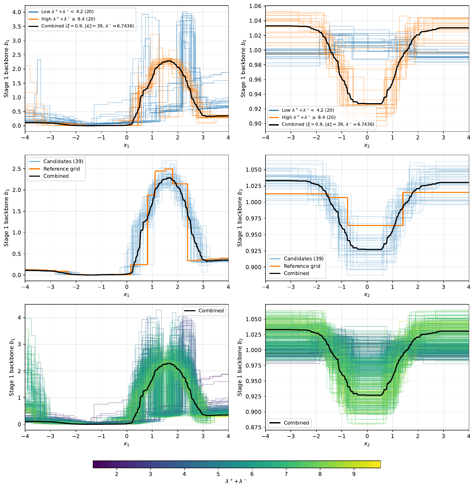

# Bagging & aggregation

A stage is not a single grid tensor but an **aggregate of $n_{\text{grids}}$ bagged grids**,
fit independently and combined into one stage component. This page covers the combination
math; the code lives in [`StagePredictor`](../code/stage-predictor.md)
(`fit_ensemble`, `aggregate_bagged_two_tensor`, `combine_grids`).

## Why aggregate components, not predictions

An arithmetic mean of products is **not** a product, so averaging the stage predictors
$\hat{m}_{\pm}^{(\ell,c)}$ would break the separable structure. Instead, the per-feature
components $\hat{m}_{\pm,j}^{(\ell,c)}$ are averaged. But factor-wise averaging is fragile:
separable representations are [non-identifiable](model.md#identifiability-and-stability),
so independently fitted factors need not lie in a comparable gauge — two grids can fit the
*same* stage yet sit at opposite ends of the $(\lambda_+,\lambda_-)$ spectrum. The
align → normalize → reference → filter → average pipeline below resolves this.

## The aggregation pipeline

Working in the backbone/tilt parametrization, the combination proceeds in steps (Combine
Bagged Two-Tensor Grids):

1. **Align to a common grid.** Refine every bag to the union of all split points per axis
   (`refine_grids_to_union_two_tensor`), so all grids share interval structure.

2. **Normalize (gauge-fix).** For each bag and axis $j$, center $\log b_j$ and $d_j$ by
   subtracting their empirical means over the data:
   $\log b_j \leftarrow \log b_j - \tfrac1n\sum_i \log b_j(x_j^{(i)})$ and
   $d_j \leftarrow d_j - \tfrac1n\sum_i d_j(x_j^{(i)})$. This makes similarities compare
   *shapes* rather than scale or offset. ($\lambda$'s are untouched here.)

3. **Choose a reference.** Pick the grid closest to the $(\lambda_+,\lambda_-)$ centroid:

    $$
    \mathcal{G}^\star = \arg\min_{c}\ \sum_{c'=1}^{n_{\text{grids}}}\bigl[(\lambda_{+}^{(c)}-\lambda_{+}^{(c')})^2 + (\lambda_{-}^{(c)}-\lambda_{-}^{(c')})^2\bigr].
    $$

4. **Score by similarity.** For each candidate form per-point backbone products and tilt
   sums, $\mathbf{b}_c = \bigl[\prod_j b_j^{(c),k_j(i)}\bigr]_{i=1}^n$ and
   $\mathbf{d}_c = \bigl[\sum_j d_j^{(c),k_j(i)}\bigr]_{i=1}^n$ (with $k_j(i)$ the interval
   index of $x_j^{(i)}$), and take cosine similarities to the reference:

    $$
    \mathrm{sim}_b = \frac{\mathbf{b}^\star\cdot\mathbf{b}_c}{\|\mathbf{b}^\star\|\,\|\mathbf{b}_c\|},
    \qquad
    \mathrm{sim}_d = \frac{\mathbf{d}^\star\cdot\mathbf{d}_c}{\|\mathbf{d}^\star\|\,\|\mathbf{d}_c\|}.
    $$

    The combined score rescales the product of the two cosines into $[0,1]$:

    $$
    \mathrm{score}(c) = \frac{(\mathrm{sim}_b + 1)(\mathrm{sim}_d + 1)}{4} \in [0,1].
    $$

5. **Trim.** Keep the top $K = \lceil(1-\xi)\,n_{\text{grids}}\rceil$ candidates by score,
   where $\xi\in[0,1]$ is the `similarity_threshold` (default $\xi=0$ keeps all). This
   removes a competing representation branch before averaging.

6. **Average and reconstruct.** Average the surviving factors in log-space and rebuild the
   backbone/tilt. With $a_{\pm,j}^k = b_j^k e^{\pm d_j^k}$,

    $$
    \bar{a}_{\pm,j}^k = \exp\!\Bigl(\tfrac{1}{|\mathcal{K}|}\sum_{c\in\mathcal{K}} \log a_{\pm,j}^{(c),k}\Bigr),
    \qquad
    \bar{b}_j^k = \sqrt{\bar{a}_{+,j}^k\,\bar{a}_{-,j}^k},
    \quad
    \bar{d}_j^k = \tfrac12\log\!\bigl(\bar{a}_{+,j}^k/\bar{a}_{-,j}^k\bigr).
    $$

7. **Combine scalars** by geometric mean:
   $\lambda_{\pm}^{\text{combined}} = \exp\bigl(\tfrac{1}{|\mathcal{K}|}\sum_{c\in\mathcal{K}}\log\lambda_{\pm}^{(c)}\bigr)$.

After combination the stage coefficients are refit by least squares (the
[backfit](fitting.md#coefficient-backfitting)).

## Aggregation modes in code

The `Aggregation` enum on `StagePredictor` selects how the bag is reduced to the
`primary_grid_tensor`:

| Mode | Behavior |
|------|----------|
| `Mean` | arithmetic mean of the unscaled per-grid predictions |
| `GeometricMean` | sign-preserving geometric mean of predictions |
| `Combined` | extract $\tilde{m}_+, \tilde{m}_-$ from the aggregated two-tensor grid and apply the OLS `scaling_plus`/`scaling_minus` |

The component-space pipeline above (align → normalize → similarity-filter → log-space
average) is implemented in `aggregate_bagged_two_tensor`; the chosen `Aggregation` then
determines how the combined grid is turned into stage predictions. See
[StagePredictor](../code/stage-predictor.md) for the exact call path and how
`similarity_threshold` ($\xi$) and the aggregation mode are wired from the Python API.

## The bimodal-alignment example

There is a worked case where bagged grids converge to two distinct backbone representations
of one fitted stage (a consequence of [non-identifiability](model.md#identifiability-and-stability)).
Without the similarity filter, averaging across the two branches degrades the fit; the
reference + trim step keeps a single canonical branch. The `synthetic2.py` example
reproduces this diagnostic — see [Examples](../index.md#examples).

<figure markdown="span">
  { width="90%" }
  <figcaption markdown="span">Synthetic example — bagged [GridTensors](../code/grid-tensor.md) at epoch 0 converging to two distinct backbone shapes for the same stage (two clusters of curves visible in the plot). This bimodality is a consequence of the [sign-flip non-identifiability](model.md#identifiability-and-stability) of the two-tensor form: both orientations fit the residuals equally well, so different trees in the bag find different local optima. The align-then-filter step computes pairwise backbone similarity, anchors to a reference tree, and discards outlier trees before averaging — collapsing the two clusters into a single canonical representation. Reproduced by the [`synthetic2.py`](../index.md#examples) example script.</figcaption>
</figure>
