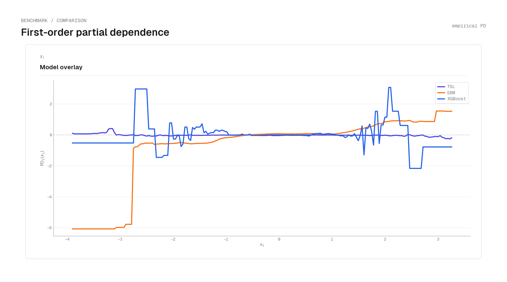
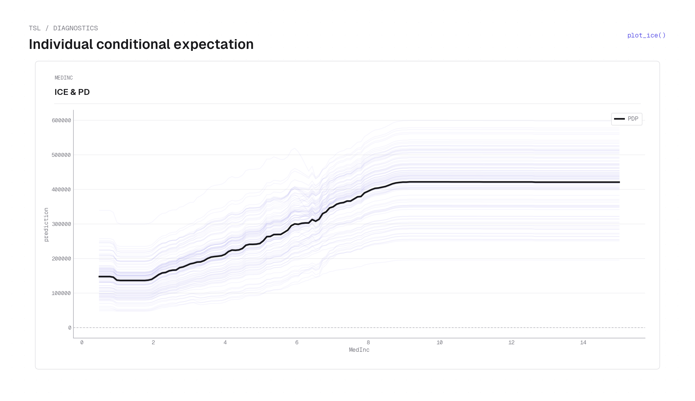

# Partial dependence

Partial dependence (PD) is the central interpretability tool for TSL. The key result is
that for a **separable** model a 1D PD curve recovers the *exact factor shape* — not a
contaminated main effect — so TSL's PD plots are model-native explanations rather than
post-hoc approximations.

## The problem with additive PD

The partial dependence of feature $j$ is the marginal expectation

$$
\mathrm{PD}_j(x_j) \coloneqq \mathbb{E}_{X_{(-j)}}\bigl[m(x_j, X_{(-j)})\bigr].
$$

For an **additive** model with functional-ANOVA decomposition
$m(\mathbf{x}) = \sum_{S\subseteq[p]} m_S(\mathbf{x}_S)$ under the usual marginal
identification constraint, the PD of $x_1$ collapses to the intercept plus the main effect,
$\mathrm{PD}_1(x_1) = m_\emptyset + m_1(x_1)$, and therefore **carries no information about
any interaction term** $m_S$ with $1\in S$ and $|S|\ge2$. Strong interactions can leave no
signature on the 1D PD at all (see the [masked-interaction example](#signed-branch-pd-and-the-masked-interaction)).

## Faithfulness for separable models

For a single separable product $h(\mathbf{x}) = \prod_{j=1}^p h_j(x_j)$, marginalizing over
the other coordinates leaves the factor shape intact up to a constant:

$$
\mathrm{PD}_j[h](x_j) = c_j\, h_j(x_j),
\qquad c_j = \mathbb{E}\Bigl[\prod_{k\ne j} h_k(X_k)\Bigr]\ \text{constant in } x_j.
$$

The interaction structure lives in the product form itself, so PD recovers $h_j$ exactly
rather than collapsing it to a main effect.

## Proposition 1 — partial dependence decomposition

For a TSL estimator, fix a stage $\ell$ and coordinate $j$ and define

$$
c^{(\ell)}_{\pm,j} \coloneqq \mathbb{E}\Bigl[\prod_{k\ne j}\hat{m}_{\pm,k}^{(\ell)}(X_k)\Bigr],
\qquad
C^{(\ell)}_{\pm,j} \coloneqq c^{(\ell)}_{\pm,j}\,\lambda_{\pm}^{(\ell)}.
$$

Then the 1D partial dependence of each signed branch **factorizes** into the factor shape
times a constant:

$$
\mathrm{PD}_{\pm,j}^{(\ell)}(x_j) \coloneqq \mathbb{E}\bigl[\hat{m}_{\pm}^{(\ell)}(x_j, X_{(-j)})\bigr] = C^{(\ell)}_{\pm,j}\,\hat{m}_{\pm,j}^{(\ell)}(x_j).
$$

Moreover, with $\bar{m}_{\pm}^{(\ell)} \coloneqq \mathbb{E}[\hat{m}_{\pm}^{(\ell)}(X)]$ and
$Z_{\pm}^{(\ell)} \coloneqq \mathbb{E}\bigl[\prod_{j=1}^p \mathrm{PD}_{\pm,j}^{(\ell)}(X_j)\bigr]$,
the stage admits an **exact reconstruction** from its 1D curves:

$$
\hat{m}_{\pm}^{(\ell)}(\mathbf{x}) = \frac{\bar{m}_{\pm}^{(\ell)}}{Z_{\pm}^{(\ell)}}\prod_{j=1}^p \mathrm{PD}_{\pm,j}^{(\ell)}(x_j).
$$

So each stage — and any explanation built from its factors — is recoverable from 1D PD
summaries up to a single scalar normalizer per stage and sign branch. TSL's 1D PD plots
therefore recover the fitted factor shapes (up to the constants $C^{(\ell)}_{\pm,j}$)
**without a surrogate**.

<figure markdown="span">
  { width="100%" }
  <figcaption markdown="span">California housing — TSL's summed $\hat{m}_+$ branch PD for Latitude (left) and Longitude (right) compared with EBM, XGBoost (blackbox and interpretable), and SepALS. TSL (dark blue) preserves sharp localized peaks — a spike near lat 37–38 (Bay Area) and a concentrated coastal band near lon −122 — while the baselines smooth this into nearly monotone slopes. The faithfulness follows directly from Proposition 1: for a separable model, marginalizing over the other features leaves the factor shape $\hat{m}_{\pm,j}(x_j)$ intact up to the constant $C_{\pm,j}$, so the 1D PD curve is an exact scaled copy of the factor, not a contaminated main effect.</figcaption>
</figure>

!!! note "Implementation note — empirical marginalization"
    `TSL.compute_partial_dependence_function` (`tsl-py/src/lib.rs`) marginalizes over the
    **empirical joint** distribution of the other features, not a product-of-marginals
    reference, so the constants $c^{(\ell)}_{\pm,j}$ are estimated correctly under feature
    correlation. The function returns, per stage, the $(C_+, C_-)$ constants and the curve
    values. The algebraic factorization holds for any reference distribution; only the
    statistical meaning of the average depends on that choice.

## Backbone–tilt reconstruction from PD

The backbone and tilt can be read directly off the signed-branch PD curves (in the
normalized gauge):

$$
b_j^{(\ell)}(x_j) = \bigl(C_{+,j}^{(\ell)} C_{-,j}^{(\ell)}\bigr)^{-1/2}\sqrt{\mathrm{PD}_{+,j}^{(\ell)}(x_j)\,\mathrm{PD}_{-,j}^{(\ell)}(x_j)},
$$

$$
d_j^{(\ell)}(x_j) = \tfrac12\log\!\frac{\mathrm{PD}_{+,j}^{(\ell)}(x_j)}{\mathrm{PD}_{-,j}^{(\ell)}(x_j)} + \gamma_j^{(\ell)},
\qquad \gamma_j^{(\ell)} = \tfrac12\log\!\frac{C_{-,j}^{(\ell)}}{C_{+,j}^{(\ell)}}.
$$

The backbone is a **magnitude** summary that cannot cancel even when the signed stage PD
$\mathrm{PD}_j^{(\ell)} = \mathrm{PD}_{+,j}^{(\ell)} - \mathrm{PD}_{-,j}^{(\ell)}$ is near
zero; the tilt captures the signed direction. Only the $(+)$ and $(-)$ PD curves per
feature need be plotted to faithfully explain the model.

## Signed-branch PD and the masked interaction

Consider independent features with $Y = x_1^2\,x_2\,(1+x_3) + \varepsilon$ and
$\mathbb{E}[1+X_3]=0$. Then the population 1D PD of $x_1$ is identically zero —
$\mathrm{PD}_1(x_1) = x_1^2\,\mathbb{E}[X_2]\,\mathbb{E}[1+X_3] = 0$ — even though $x_1$ has a
strong effect. **Every** model (TSL included) yields a near-zero 1D PD here, consistent
with the population identity.

TSL's **signed-branch** PD escapes this trap: the backbone $b_j^{(\ell)}(x_j)$ recovers the
quadratic effect of $x_1$ while the tilt stays small, so the magnitude is exposed even
though the signed PD cancels. This is the practical payoff of the two-tensor form. The
`synthetic.py` example reproduces the figure; see [Examples](../index.md#examples).

<figure markdown="span">
  { width="100%" }
  <figcaption markdown="span">Synthetic masked-interaction dataset ($Y = x_1^2\,x_2\,(1+x_3)+\varepsilon$, $\mathbb{E}[1+X_3]=0$) — the signed 1D PD of $x_1$ is near zero for every model (TSL, EBM, XGBoost), matching the population identity $\mathrm{PD}_1(x_1)=0$. Yet the TSL-specific $\hat{m}_+$ branch curve recovers the underlying quadratic shape of $x_1$: the backbone $b_j$ separates magnitude from sign, so the $\hat{m}_+ \hat{m}_-$ product is large and quadratic even when the signed difference $\hat{m}_+ - \hat{m}_-$ cancels. Reproduced by the [`synthetic.py`](../index.md#examples) example script.</figcaption>
</figure>

## Derived diagnostics

The Python layer builds several interpretation primitives on top of the PD math:

- **ICE curves** — `compute_ice_curves` traces individual conditional expectations
  (per-observation analogues of PD), scaled by `scaling_plus`/`scaling_minus`.
- **First-order PD per feature** — `compute_first_order_partial_dependence_functions`.
- **Feature importance** — variance-based backbone and tilt importance per stage, rolled
  up across stages by an energy weight into a combined score $I_j$
  ([defined below](#feature-importance)).

<figure markdown="span">
  { width="80%" }
  <figcaption markdown="span">Individual conditional expectation (ICE) curves on California housing for MedInc — each faint line traces one sampled observation's predicted price as MedInc varies while all other features are held fixed. The bold line is the average PD curve. The tight, upward-trending band shows that MedInc has a consistent positive direction across observations: every home benefits from higher income, but homes in high-value locations start from a higher baseline (vertical spread). ICE is the per-observation analogue of PD; see [`plot_ice`](../code/plotting.md#fn-plot-ice) for the API.</figcaption>
</figure>

### Feature importance

Feature importance reads off the [backbone–tilt](model.md#backbone-and-exponential-tilt)
decomposition: a feature matters to a stage to the extent that its backbone (the magnitude
gate) or its tilt (the signed direction) *varies* across the data. Evaluate the per-feature
factors on the training sample $\{x^{(i)}\}_{i=1}^n$ and take their empirical variances. For
stage $\ell$ and feature $j$,

$$
I_j^{b,(\ell)} = \mathrm{Var}_n\!\bigl[\log b_j^{(\ell)}(X_j)\bigr],
\qquad
I_j^{d,(\ell)} = \mathrm{Var}_n\!\bigl[d_j^{(\ell)}(X_j)\bigr],
$$

writing $\mathrm{Var}_n[g] = \tfrac1n\sum_{i}\bigl(g(x_j^{(i)}) - \tfrac1n\sum_{i'} g(x_j^{(i')})\bigr)^2$
for the empirical variance over the sample. The backbone variance is taken on the log scale
because the backbone enters the stage [multiplicatively](model.md#the-sinh-form); under the
[normalization gauge](model.md#normalization-gauge-fixing)
$\mathbb{E}[\log b_j^{(\ell)}] = \mathbb{E}[d_j^{(\ell)}] = 0$, so both are second moments
about zero. A feature whose backbone and tilt are flat across the sample contributes nothing
to that stage and scores zero.

Stages are then weighted by how much they actually move the prediction — their **energy**,
the mean-squared stage contribution:

$$
\omega_\ell = \frac{E_\ell}{\sum_{k=1}^{R} E_k},
\qquad
E_\ell = \bigl\lVert \hat{m}^{(\ell)} \bigr\rVert_n^2 = \frac1n\sum_{i=1}^n \hat{m}^{(\ell)}\!\bigl(x^{(i)}\bigr)^2,
$$

where $\hat{m}^{(\ell)} = \hat{m}_+^{(\ell)} - \hat{m}_-^{(\ell)}$ is the stage's signed
contribution to $\hat{m}$ (the per-stage OLS scalings `scaling_plus`/`scaling_minus` are
folded in; see [StagePredictor](../code/stage-predictor.md)). The per-stage importances
aggregate to global scores, and a single combined score folds the two channels together
with a tilt weight $\gamma \ge 0$ (default $1$):

$$
I_j^b = \sum_{\ell=1}^{R} \omega_\ell\, I_j^{b,(\ell)},
\qquad
I_j^d = \sum_{\ell=1}^{R} \omega_\ell\, I_j^{d,(\ell)},
\qquad
I_j = I_j^b + \gamma\, I_j^d.
$$

`compute_per_stage_feature_importance` returns the per-stage grids
$I_j^{b,(\ell)}, I_j^{d,(\ell)}$, `compute_aggregated_feature_importance` returns the global
$I_j^b, I_j^d$ together with the weights $\omega_\ell$, and
`compute_combined_feature_importance` returns $I_j$ — all rendered by
[`plot_feature_importance`](../code/plotting.md#fn-plot-feature-importance).

All of these are plotted by the `tensorsl.plot` helpers — see the
[Plotting reference](../code/plotting.md).
