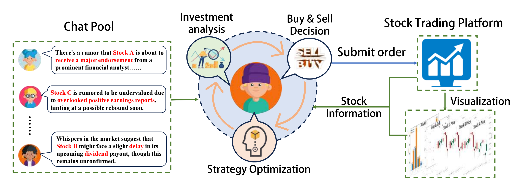

# Agent Trading Arena

<p align="center">
  <a href="https://arxiv.org/abs/2502.17967"></a>
  <a href="https://aclanthology.org/2025.findings-emnlp.294.pdf"></a>
  
</p>

<p align="center">
  <b>Agent Trading Arena: A Study on Numerical Understanding in LLM-Based Agents</b>
</p>

<p align="center">
  Tianmi Ma, Jiawei Du, Wenxin Huang, Wenjie Wang, Liang Xie, Xian Zhong, Joey Tianyi Zhou
</p>

<p align="center">
  <a href="https://arxiv.org/abs/2502.17967">arXiv</a> |
  <a href="https://aclanthology.org/2025.findings-emnlp.294.pdf">Paper</a> |
  <a href="#quick-start">Quick Start</a> |
  <a href="#citation">Citation</a>
</p>

<p align="center">
  
</p>

> **News:** This work has been accepted to Findings of EMNLP 2025.

## Overview

Agent Trading Arena is a closed-loop, prior-free, human-like trading environment for evaluating numerical understanding in LLM-based financial agents. Agents observe market states, reason over stock information, make trading decisions, and receive feedback through market outcomes.

This folder contains the original codebase for the Findings of EMNLP 2025 paper. For the follow-up DecoupledMarket project, see [`../decoupledmarket/`](../decoupledmarket/).

## Highlights

- Closed-loop market simulation for LLM-based trading agents.
- Prior-free environment design for studying agent self-play.
- Persona-driven agents with memory, reflection, and trading actions.
- Prompt templates for analysis, buy/sell decisions, gossip, and reflection.
- Reproduction entry point for the Findings of EMNLP 2025 paper.

## Quick Start

From the repository root:

```bash
pip install -r requirement.txt
cd Agent-Trading-Arena
sh run.sh
```

The script runs:

```bash
python Stock_Main/main.py \
  --Iterations_Daily 5 \
  --No_Days 10 \
  --Num_Person 12 \
  --Num_Stock 4 \
  --SAVE_NAME sim_test01
```

## API Keys

Set API keys through environment variables. Do not hard-code API keys in source files.

```bash
export OPENAI_API_KEY="..."
```

If your local setup uses a different provider or key name, configure it in the corresponding LLM helper under `Stock_Main/content/`.

## Folder Structure

```text
Agent-Trading-Arena/
|-- Stock_Main/              # Main simulation code
|   |-- content/             # Prompt templates and LLM helpers
|   |-- save/                # Saved simulation data and examples
|   |-- main.py              # Simulation entry point
|   |-- Market.py            # Market logic
|   |-- Person.py            # Agent and broker logic
|   `-- Stock.py             # Stock and market index logic
`-- run.sh                   # Example run script
```

## Citation

If you find this work useful, please cite:

```bibtex
@inproceedings{ma2025agent,
  title={Agent Trading Arena: A Study on Numerical Understanding in LLM-Based Agents},
  author={Ma, Tianmi and Du, Jiawei and Huang, Wenxin and Wang, Wenjie and Xie, Liang and Zhong, Xian and Zhou, Joey Tianyi},
  booktitle={Findings of the Association for Computational Linguistics: EMNLP 2025},
  pages={5496--5514},
  year={2025}
}
```
