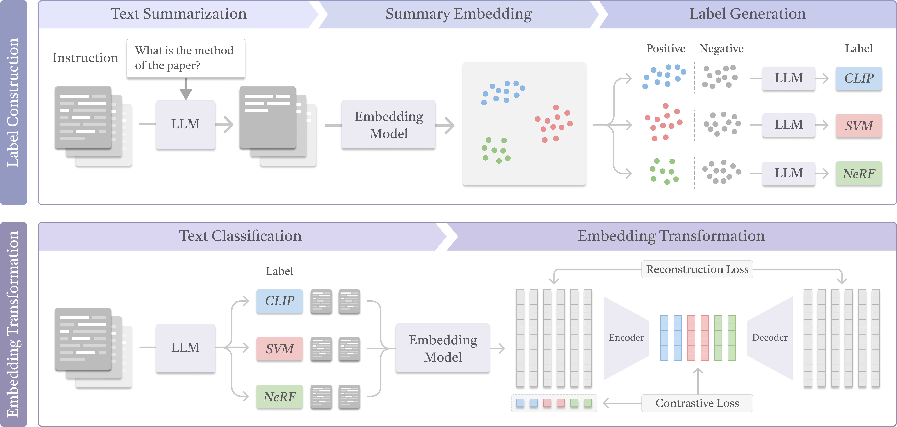

# [ACL 2025] Efficient Instruction-Following Text Embedding based on Guided Space Transformation.

This is the repository for our paper "Don't Reinvent the Wheel: Efficient Instruction-Following Text Embedding based on Guided Space Transformation".



**Paper**: [arXiv](https://arxiv.org/abs/2505.24754) | **Authors**: [Yingchaojie Feng](https://yingchaojiefeng.github.io/), [Yiqun Sun](https://www.comp.nus.edu.sg/~sunyq/), Yandong Sun, [Minfeng Zhu](https://minfengzhu.github.io/), [Qiang Huang](https://sites.google.com/site/qianghuang2017), [Anthony K. H. Tung](https://www.comp.nus.edu.sg/~atung/), [Wei Chen](http://www.cad.zju.edu.cn/home/chenwei/)

## News

- **[2025-06]** Our paper is selected for an oral presentation at ACL! 🎉🎉🎉
- **[2025-05]** Our paper is accepted to ACL 2025! 🎉🎉🎉


## Installation
Install Python packages.

```bash
pip install -r requirements.txt
```

## Quick Start

1. Load model.

```python
from encoder import GSTransform_Encoder

encoder = GSTransform_Encoder()
```

2. Pre-encode texts.

```python
base_embeddings = encoder.pre_encode(
    texts=list_of_texts,
    cache_name="cache_name"
)
```

3. Transform embeddings based on instruction.

```python
transformed_embeddings = encoder.transform(
    instruction="Specify instruction here",
    cache_name="cache_name"
)
```

## Evaluation
1. Configure the dataset (line 20 in [data.py](data.py)), instruction (line 289 in [label_construction.py](label_construction.py)), and OpenAI API key (line 8 in [util.py](util.py)).

2. Run the project.

```bash
python data.py
python label_construction.py
python train.py
python evaluate_cluster.py
# python evaluate_sts.py
# python evaluate_triplet.py
```

## How to cite

If the paper and code help your research projects, please considering citing our [paper](https://arxiv.org/abs/2505.24754):

```
@article{feng2025don,
  title={Don't Reinvent the Wheel: Efficient Instruction-Following Text Embedding based on Guided Space Transformation},
  author={Feng, Yingchaojie and Sun, Yiqun and Sun, Yandong and Zhu, Minfeng and Huang, Qiang and Tung, Anthony KH and Chen, Wei},
  journal={arXiv preprint arXiv:2505.24754},
  year={2025}
}
```