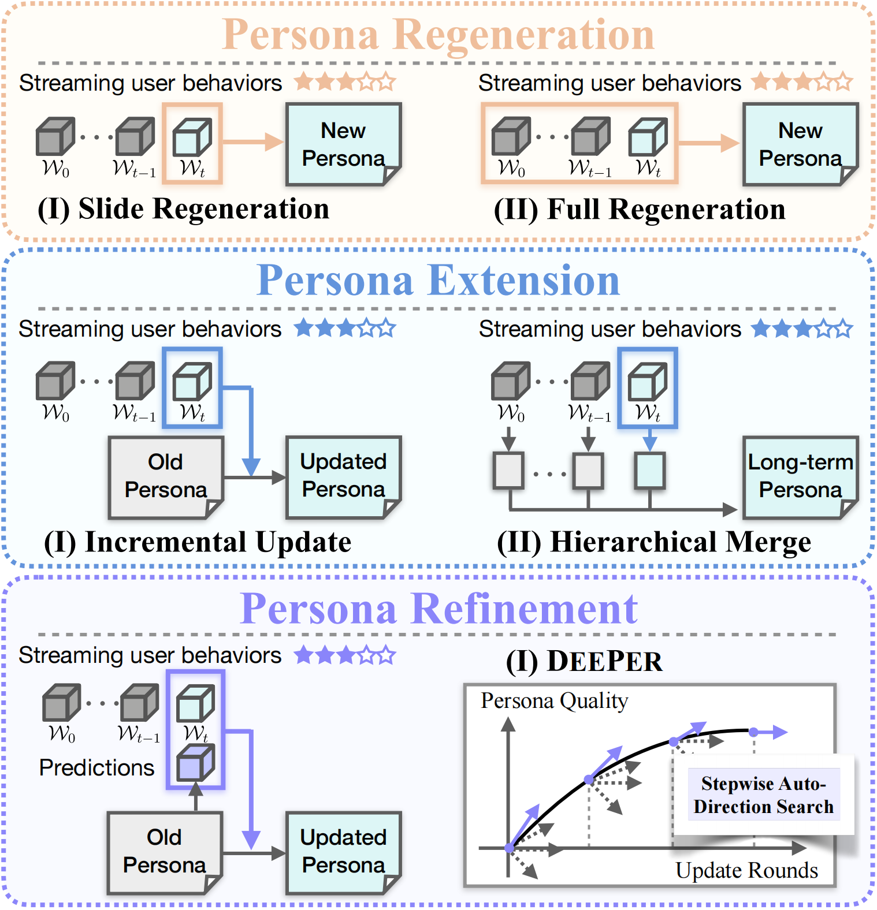
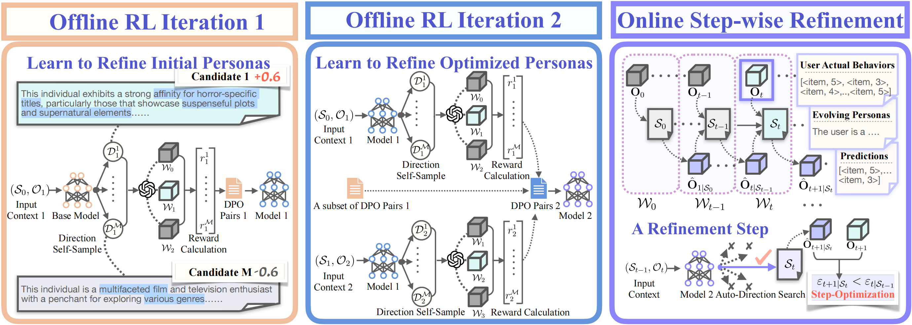
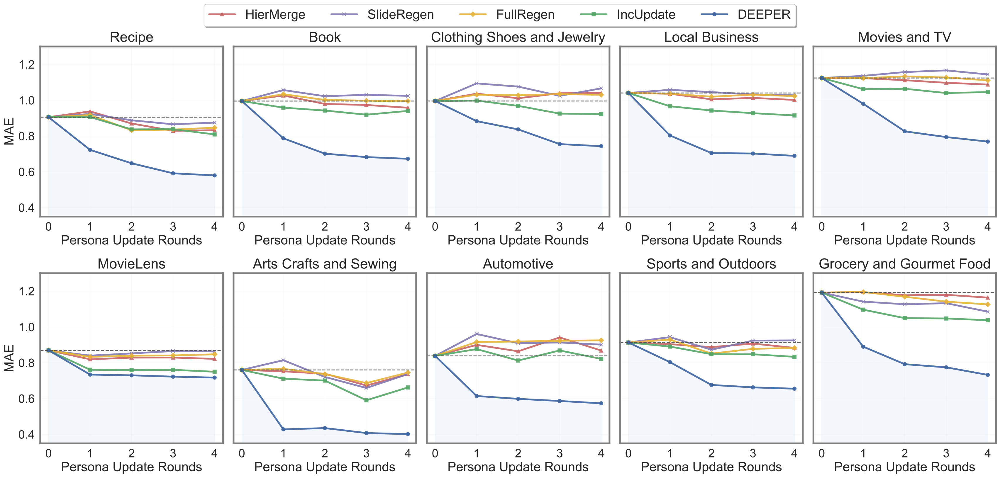

<p align="center">
  
</p>

<h1 align="center">DEEPER: Directed Persona Refinement for Dynamic Persona Modeling</h1>


<p align="center">
  <sup>1</sup> <a href="https://sheep333c.github.io/">Aili Chen</a> &nbsp;&nbsp;
  <sup>2</sup> <a href="https://scholar.google.com.hk/citations?user=tfwhN2gAAAAJ&hl=zh-CN">Chengyu Du</a> &nbsp;&nbsp;
  <sup>3</sup> <a href="https://jiangjiechen.github.io/">Jiangjie Chen</a> &nbsp;&nbsp;
  <sup>4</sup> <a href="mailto:jhxu21@m.fudan.edu.cn">Jinghan Xu</a> &nbsp;&nbsp;
  <sup>5</sup> <a href="https://ykzhang721.github.io/">Yikai Zhang</a> &nbsp;&nbsp;
  <sup>6</sup> <a href="https://siyuyuan.github.io/">Siyu Yuan</a>
</p>

<p align="center">
  <a href="https://arxiv.org/abs/2502.11078">📄 Paper</a> •
  <a href="https://github.com/sheep333c/DEEPER.git">💻 Project Page</a> •
  <a href="https://huggingface.co/deeper-team/DEEPER-llama-8B">🤖 Model</a> •
  <a href="https://huggingface.co/deeper-team">📂 Dataset Hub</a>
</p>

<p align="center">
  
  
  
</p>


<p align="center">
  Affiliation: Fudan University
</p>


## 🎯 Overview

**DEEPER** introduces a novel *refinement-based paradigm* for **dynamic persona modeling**, addressing the fundamental limitations of traditional **regeneration** (replacing personas) and **extension** (incrementally appending behaviors) approaches.

<p align="center">
  
</p>
<p align="center"><i>Figure 1: DEEPER's refinement paradigm enables directed persona evolution via prediction-behavior feedback.</i></p>

Unlike prior work that updates user personas in a static or heuristic manner, DEEPER leverages **prediction–behavior discrepancies** to guide *update directions* in a structured, reward-driven way. This enables:

- ✨ **Continual persona optimization** over time  
- 🔄 **Iterative refinement** via offline reinforcement learning  
- 🎯 **Improved behavior prediction** across both seen and unseen domains  

---

## ⚙️ Method Highlights

<p align="center">
  
</p>
<p align="center"><i>Figure 2: Two-stage offline training with DPO, followed by online refinement guided by behavior-prediction error.</i></p>

- 🧭 **Tri-objective reward design** for refinement **Direction Search**:
  - **Previous Preservation** (retain stable traits)
  - **Current Reflection** (adapt to recent behaviors)
  - **Future Advancement** (enhance predictive capability)

- 🤖 **Two-stage iterative offline RL training**:
  - DEEPER employs a two-stage offline training pipeline comprising direction sampling, goal-driven reward assignment, and preference optimization.  
  - **Iteration 1** learns to refine initial personas via direction-sampling and multi-objective reward-guided DPO.  
  - **Iteration 2** fine-tunes on optimized personas with harder preference pairs and expanded reward margins.

- 🔍 **Discrepancy-driven refinement**:
  - Uses prediction errors as feedback signals to inform how personas should evolve—bridging the gap between behavior space (e.g., ratings) and latent persona space.

---

## 📊 Experimental Results


- 🔁 **Continual Optimization**:  
  Achieves **32.2% average MAE reduction** over four rounds—significantly outperforming regeneration- and extension-based methods.

- 🌍 **Cross-Domain Generalization**:  
  Maintains strong performance on unseen domains (e.g., *Arts Crafts & Sewing*), with up to **36.4% MAE reduction**, surpassing seen-domain performance (29.4%).

- 🌀 **Domain-Specific Dynamics**:  
  Optimization speed varies by domain (e.g., fast convergence in *Automotive*, gradual in *Movies & TV*), revealing DEEPER’s ability to adapt to domain complexities.

<p align="center">
  
</p>
<p align="center"><i>Figure: DEEPER outperforms baselines in accuracy, coherence, and generalization across all domains.</i></p>

---

## 🚀 Features Summary

- ✅ Novel *refinement-based* dynamic persona modeling  
- ✅ Tri-objective reward function: Previous Preservation, Current Reflection, Future Advancement  
- ✅ Two-stage iterative offline RL framework  
- ✅ Evaluated on **10 domains**, including **4 unseen domains**  
- ✅ Trained and tested on data from **4,800+ real users** with multi-turn behavioral histories  
- ✅ Strong generalization to new users and tasks without re-training  

## 🛠 Installation

We recommend using Python 3.10 and Conda.  
You’ll also need to install [LLaMA-Factory](https://github.com/hiyouga/LLaMA-Factory):

```bash
conda create -n deeper python=3.10
conda activate deeper
git clone https://github.com/hiyouga/LLaMA-Factory.git
cd LLaMA-Factory
pip install -e ".[torch,metrics]" --no-build-isolation
```

---

## 📂 Data
We organize the DEEPER dataset into four key components, all available via our [📂 HuggingFace Dataset Hub](https://huggingface.co/deeper-team):

### 📌 1. Preprocessed Data
We curated real-world user behavior datasets spanning **10 distinct domains** (e.g., movies, books, apps, etc.). From each domain:

- We randomly selected users with **over 50 rating history entries**
- For each selected user, we extracted their **chronologically ordered behavioral stream**
- The data was then **cleaned, anonymized, and formatted** into a unified structure for downstream persona modeling

🔗 [Browse the Preprocessed Dataset on HuggingFace](https://huggingface.co/datasets/deeper-team/DEEPER_preprocess_data)


This preprocessed data forms the foundation for constructing user contexts and generating supervised training examples.

| Dataset                                                | Abbreviation               | Usage      | # Users in Train | # Users in Eval | Domain Label |
|--------------------------------------------------------|----------------------------|------------|------------------|------------------|--------------|
| Food.com Recipes and Interactions                      | Recipe                     | Train/Eval | 1000             | 356              | A            |
| Amazon Reviews (Books)                                 | Book                       | Train/Eval | 3000             | 897              | B            |
| Amazon Reviews (Clothing Shoes and Jewelry)            | Clothing Shoes and Jewelry| Train/Eval | 300              | 243              | C            |
| Google Local Data (New York, 2021)                     | Local Business             | Train/Eval | 2500             | 826              | D            |
| Amazon Reviews (Movies and TV)                         | Movies and TV              | Train/Eval | 1000             | 837              | E            |
| MovieLens 20M                                          | MovieLens                  | Train/Eval | 3000             | 1000             | F            |
| Amazon Reviews (Art Crafts and Sewing)                 | Art Crafts and Sewing      | Eval       | -                | 86               | G            |
| Amazon Reviews (Automotive)                            | Automative                 | Eval       | -                | 143              | H            |
| Amazon Reviews (Sports and Outdoors)                   | Sports and Outdoors        | Eval       | -                | 236              | I            |
| Amazon Reviews (Grocery and Gourmet Food)              | Grocery and Gourmet Food   | Eval       | -                | 185              | J            |

### 👥 2. User Context Data

We construct structured multi-turn user contexts from the filtered preprocessed user data. These contexts simulate **step-by-step persona refinement**, supporting fine-grained modeling across time windows.

Each user context includes:
- Chronologically segmented **rating sequences** per iteration
- Corresponding **item metadata** (e.g., item ID, title, category)
- Multiple rounds per user to support **persona updates over time**

🔗 [Browse the User Context Dataset (Train/Eval) on HuggingFace](https://huggingface.co/datasets/deeper-team/DEEPER_user_context_data/tree/main)


📁 The dataset is organized into:

```plaintext
user_context_test/
  ├── iteration_1.json
  ├── iteration_2.json
  ├── iteration_3.json
  └── iteration_4.json
user_context_train/
  ├── iteration_1.json
  └── iteration_2.json
```

### 🧠 3. DEEPER Training Data
We construct the final training set using DEEPER’s self-sampling and iterative optimization framework, fine-tuned over two iterations.

🔗 [Browse the DEEPER Train Dataset on HuggingFace](https://huggingface.co/datasets/deeper-team/DEEPER_train_data)


### 🔄 4. Evolving Personas over Four Update Rounds

We visualize how personas evolve over four refinement rounds using **DEEPER** and baseline methods. This qualitative analysis highlights DEEPER's ability to generate increasingly accurate and user-aligned personas.

🔗 [Browse the Evolving Personas Dataset on HuggingFace](https://huggingface.co/datasets/deeper-team/evolving_personas/tree/main)

The comparison includes the following methods:

- ✅ **DEEPER (ours)** — refinement-based persona modeling via discrepancy-driven updates  
- 🔁 **Incremental Update** — appends new behavior traits to the previous persona directly  
- 🧩 **Hierarchical Merge** — merges prior and current personas using hierarchical rules 
- 🧱 **Full Regeneration** — regenerates the entire persona from scratch at each iteration  
- 📉 **Slide Regeneration** — generates new persona using only the latest time window, ignoring past

Each method refines personas based on the same user behavior stream. DEEPER produces more **coherent**, **progressively accurate**, and **non-redundant** persona descriptions over iterations.

---

## Citation Information

If our paper or related resources prove valuable to your research, we kindly ask for citation. 


```
@article{chen2025deeper,
  title={Deeper insight into your user: Directed persona refinement for dynamic persona modeling},
  author={Chen, Aili and Du, Chengyu and Chen, Jiangjie and Xu, Jinghan and Zhang, Yikai and Yuan, Siyu and Chen, Zulong and Li, Liangyue and Xiao, Yanghua},
  journal={arXiv preprint arXiv:2502.11078},
  year={2025}
}
```