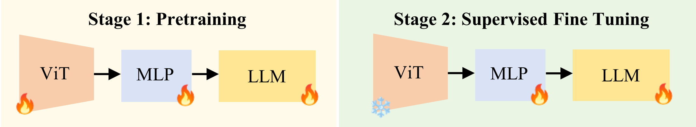

#  VHM: Versatile and Honest Vision Language Model for Remote Sensing Image Analysis

[](https://arxiv.org/abs/2403.20213) 

[[Project Page](https://fitzpchao.github.io/vhm_page/)] [[Paper](https://arxiv.org/abs/2403.20213)] [[Model🤗](https://huggingface.co/FitzPC/vhm_7B)] [[Dataset1](https://opendatalab.com/OpenDataLab/VHMData)][[Dataset2🤗](https://huggingface.co/datasets/FitzPC/VHM_VersaD/tree/main)] [[RSEvalKit](https://github.com/fitzpchao/RSEvalKit)]


<!-- <div style="display: flex; justify-content: center;" align="center">
<center>

</div> -->
<div style="display: flex; justify-content: center;">
  
</div>

## News

- **2024.12.19** The full version of the paper with the appendix has been uploaded to [ArXiv](https://arxiv.org/abs/2403.20213).🔥🔥🔥
- **2024.12.9** The work has been accepted by AAAI 2025. 🔥🔥🔥
- **2024.11.15** The [RSEvalKit](https://github.com/fitzpchao/RSEvalKit) for one-click evaluation of RSVLMs has been released.
- **2024.11.15** The code have been released.🔥🔥🔥
- **2024.11.15** The large-scale RS image-text dataset, [VersaD](https://huggingface.co/datasets/FitzPC/VHM_VersaD), featuring rich and diverse captions, has just been released, now with a massive 1.4 million image captions. 🔥🔥🔥
- **2024.11.3** The new version of the **VHM** paper has been updated to [ArXiv](https://arxiv.org/abs/2403.20213).
- **2024.3.28** H2RSVLM paper available on [ArXiv](https://arxiv.org/abs/2403.20213).

## TODO
- [x] Release inference code and checkpoints of VHM.
- [x] Release all data in this work.
- [x] Release the training code of VHM.

## Contents
- [Install](#install)
- [Data](#data)
- [Models](#model)
- [Train](#train)
- [Evaluation](#evaluation)
## Install
Refer to the following command for installation.
```bash
git clone git@github.com:opendatalab/VHM.git
cd VHM
conda create -n vhm 
conda activate vhm
pip install -r requirment.txt
```
## Data
You should follow this instruction [Data.md](docs/Data.md) to manage the datasets. If you need to train our model from scratch, please refer to for data download and preparation first.
## Models
VHM consists of a visual encoder, a projector layer, and a large language model (LLM). The visual encoder uses a pretrained [CLIP-14-336px](https://huggingface.co/openai/clip-vit-large-patch14-336), the projector layer is composed of two MLP layers, and the LLM is based on the pretrained [Vicuna-7B](https://huggingface.co/lmsys/vicuna-7b-v1.5). The model is trained in two stages, as shown in the diagram below.




We provide not only the weights after the SFT stage but also the Pretrained weights.

| Name | Description|
|---|---|
|[VHM_sft](https://huggingface.co/FitzPC/vhm_7B) | The LLM and MLP weights obtained from the SFT stage| 
|[VHM_pretrain](https://huggingface.co/FitzPC/vhm_7b_pretrain_mlp_llm/tree/main) | The LLM and MLP weights obtained from the Pretraining stage.|
|[CLIP_pretrain](https://huggingface.co/FitzPC/vhm_7b_pretrain_vit)|The CLIP weights obtained from the  Pretraining stage.|


## Train
VHM model training consists of two stages: (1) Pretrain stage: use our VersaD dataset with 1.4M image-text pairs to finetune the vision encoder, projector, and the LLM to align the textual and visual modalities; (2) Supervised Fine-Tuning（SFT） stage: finetune the projector and LLM to teach the model to follow multimodal instructions. 
### Pretrain
First, you should download the [MLP projector](https://huggingface.co/liuhaotian/llava-v1.5-mlp2x-336px-pretrain-vicuna-7b-v1.5/tree/main) pretrained by LLaVA-1.5. Because a rough modality alignment process is beneficial before using high quality detailed captions for modality alignment.

You can run `sh scripts/rs/slurm_pretrain.sh` to pretrain the model. Remember to specify the projector path in the script. In this stage, we fine-tuned the second half of the vision encoder's blocks, projector, and LLM.

In our setup we used 16 A100 (80G) GPUs and the whole pre-training process lasted about 10 hours. You can adjust the number of gradient accumulation steps to reduce the number of GPUs.

In the `sh scripts/rs/slurm_pretrain.sh`, you need to revise three paths:
```bash
DATA_DIR=pretrain_base # directory of VersaD dataset
export LIST_FILE=${DATA_DIR}/list_pretrain.json # json file of VersaD data  
export CKPT_PATH=weight_path # llava-1.5 MLP weight path
export SAVE_PATH=vhm-7b_prtrained # file save path
```
### Supervised Fine-Tuning
In this stage, we finetune the projector and LLM with our [VHM_SFT](https://huggingface.co/datasets/FitzPC/VHM_dataset_sft) dataset. 

In our setup we used 8 A100 (80G) GPUs and the whole sft process lasted about 4 hours. You can adjust the number of gradient accumulation steps to reduce the number of GPUs.

You can run `sh scripts/rs/slurm_finetune.sh` to finetune the model, and you need to revise three paths:
```bash
DATA_DIR=sft_base # directory of vhm-sft dataset
export LIST_FILE=${DATA_DIR}/list_sft.json # json file of sft data  
CKPT=vhm-7b_pretrained # pretrain weight path
export SAVE_PATH=vhm-7b_sft # file save path
```

## Evaluation 
In order to facilitate the use of remote sensing vision-language large models, we have developed a specialized evaluation project [RSEvalKit](https://github.com/fitzpchao/RSEvalKit) for remote sensing large models. Please refer to the following command for installation.

```sh
git clone https://github.com/fitzpchao/RSEvalKit
cd RSEvalKit
conda create -n rseval
conda activate rseval
pip install -r requirements.txt
```
All evaluation tasks for this paper are implemented in RSEval  and can be evaluated with one click. First, you need to download our [model weights](#models) and [VHM_Eval data](docs/Data.md#VHM_Eval-Dataset ), then follow the [instructions](https://github.com/fitzpchao/RSEvalKit/blob/master/README.md) to complete the evaluation.

## Citation
```bibtex
@misc{pang2024vhmversatilehonestvision,
      title={VHM: Versatile and Honest Vision Language Model for Remote Sensing Image Analysis}, 
      author={Chao Pang and Xingxing Weng and Jiang Wu and Jiayu Li and Yi Liu and Jiaxing Sun and Weijia Li and Shuai Wang and Litong Feng and Gui-Song Xia and Conghui He},
      year={2024},
      eprint={2403.20213},
      archivePrefix={arXiv},
      primaryClass={cs.CV},
      url={https://arxiv.org/abs/2403.20213}, 
}
```

## Acknowledgement
We gratefully acknowledge these wonderful works：
- [Vicuna](https://github.com/lm-sys/FastChat#vicuna-weights)
- [LLaVA](https://github.com/haotian-liu/LLaVA)
- [ShareGPT4V](https://github.com/InternLM/InternLM-XComposer/tree/main/projects/ShareGPT4V)
- [LLaMA](https://github.com/facebookresearch/llama)

## License

  **Usage and License Notices**: The data and checkpoint is intended and licensed for research use only. They are also restricted to uses that follow the license agreement of LLaMA, Vicuna and Gemini. The dataset is CC BY NC 4.0 (allowing only non-commercial use) and models trained using the dataset should not be used outside of research purposes.
