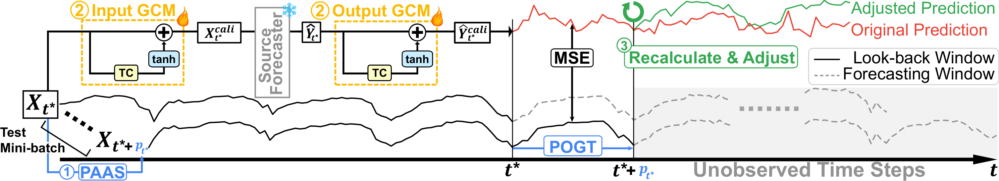

# [AAAI 2025] Battling the Non-stationarity in Time Series Forecasting via Test-time Adaptation

## Abstract
Deep Neural Networks have spearheaded remarkable advancements in time series forecasting (TSF), one of the major tasks in time series modeling. Nonetheless, the non-stationarity of time series undermines the reliability of pre-trained source time series forecasters in mission-critical deployment settings. 
In this study, we introduce a pioneering test-time adaptation framework tailored for TSF (TSF-TTA). TAFAS, the proposed approach to TSF-TTA, flexibly adapts source forecasters to continuously shifting test distributions while preserving the core semantic information learned during pre-training. The novel utilization of partially-observed ground truth and gated calibration module enables proactive, robust, and model-agnostic adaptation of source forecasters. 
Experiments on diverse benchmark datasets and cutting-edge architectures demonstrate the efficacy and generality of TAFAS, especially in long-term forecasting scenarios that suffer from significant distribution shifts.



The figure above illustrates the overview pipeline of our proposed TAFAS framework.

## Prepare Datasets
The datasets can be downloaded from the [Time-Series-Library](https://github.com/thuml/Time-Series-Library).

### Datasets
- ETTh1
- ETTm1
- ETTh2
- ETTm2
- exchange_rate
- weather

Place the downloaded datasets in `data/{dataset}/{dataset}.csv`.

**Example:** For ETTh1, place it in `data/ETTh1/ETTh1.csv`.

## Model Checkpoints
Model checkpoints can be downloaded from [Google Drive](https://drive.google.com/drive/folders/16UdpRYf3BLRfem2LXLspN78dW4MOJkbn?usp=sharing). 

You need to place the checkpoints in the project folder as stored in the Google Drive.

**Example:** For model `FreTS` and dataset `ETTh1`, place `checkpoint_best.pth` in `checkpoints/FreTS/ETTh1_720/`.

Due to Google Drive storage limitations, we only provide checkpoints for `pred_len = 720` for the following models and datasets:

### Models
- PatchTST
- DLinear
- OLS
- FreTS

### Datasets
- ETTh1
- ETTm1
- ETTh2
- ETTm2
- exchange_rate
- weather

## Example Execution Code
The script files are located in the `scripts/` directory. Run the following script to execute the model:

```bash
bash scripts/{model}/{dataset}_{pred_len}/run.sh
```

**Example:** For model `FreTS` and dataset `ETTh1`, run:

```bash
bash scripts/FreTS/ETTh1_720/run.sh
```

For settings where checkpoints are not provided, you can train the model by changing `TRAIN.ENABLE` from `False` to `True` in `run.sh`.

## Models and Layers Packages
The implementation references the [Time-Series-Library](https://github.com/thuml/Time-Series-Library).

## Citations
If you find our work useful, please cite our paper:

```bibtex
@article{kim2025battling,
    title={Battling the Non-stationarity in Time Series Forecasting via Test-time Adaptation},
    author={Kim, HyunGi and Kim, Siwon and Mok, Jisoo and Yoon, Sungroh},
    journal={arXiv preprint arXiv:2501.04970},
    year={2025}
}
```

## License
This project is licensed under the MIT License. For commercial use, permission is required.

## Acknowledgements
Please provide proper attribution if you use our codebase.  
If you use our work, please cite our paper as mentioned in the Citations section.