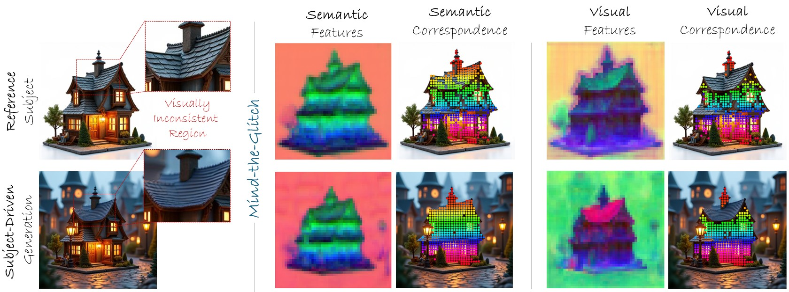

# Mind-the-Glitch
<a href='https://abdo-eldesokey.github.io/mind-the-glitch/'></a>
<a href='https://arxiv.org/abs/2509.21989'></a> 

The official implementation for the Neurips 2025 paper "Mind-the-Glitch: Visual Correspondence for Detecting Inconsistencies in Subject-Driven Image Generation"



## 🚀 Release Status

- [x] **Model Release** - Pre-trained MTG model weights and inference code
- [ ] **Training Code** - Training scripts and configuration files
- [ ] **Training Dataset** - Automated dataset generation pipeline and curated dataset
- [ ] **Evaluation Benchmark** - Benchmark evaluation code and metrics

## 📦 Installation

### Prerequisites
- Python 3.8+
- CUDA-compatible GPU (recommended)

### Setup Environment

1. **Clone the repository with submodules:**
```bash
git clone --recursive https://github.com/abdo-eldesokey/mind-the-glitch.git
cd mind-the-glitch
```

2. **Create and activate a conda environment:**
```bash
conda create -n mtg python=3.11
conda activate mtg
```

3. **Install PyTorch with CUDA support:**
```bash
pip install torch==2.5.1 torchvision==0.20.1 --index-url https://download.pytorch.org/whl/cu124
```

4. **Install remaining dependencies:**
```bash
pip install -r requirements.txt
```

5. **Initialize submodules (if not cloned recursively):**
```bash
git submodule update --init --recursive
```

6. **Install Grounded-Segment-Anything:**
```bash
git clone https://github.com/IDEA-Research/Grounded-Segment-Anything.git
cd Grounded-Segment-Anything
pip install --no-build-isolation -e GroundingDINO
cd ..
```

## 🎯 Getting Started

The easiest way to get started with Mind-the-Glitch is through our interactive playground notebook:

```bash
jupyter notebook notebooks/playground.ipynb
```

This notebook demonstrates:
- Loading the pre-trained MTG model
- Running inference on sample images
- Visualizing the disentangled features and visual correspondence.

## 📚 Citation

If you find this work useful for your research, please cite our paper:

```bibtex
@inproceedings{eldesokey2025mindtheglitch,
  title={Mind-the-Glitch: Visual Correspondence for Detecting Inconsistencies in Subject-Driven Generation},
  author={Eldesokey, Abdelrahman and Cvejic, Aleksandar and Ghanem, Bernard and Wonka, Peter},
  booktitle={Advances in Neural Information Processing Systems},
  year={2025}
}
```
