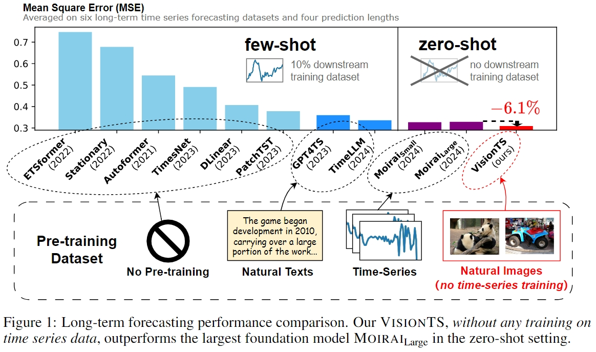
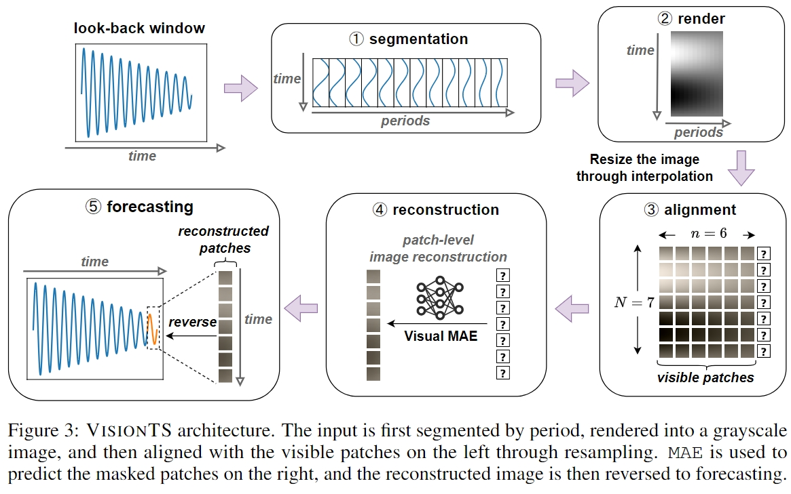
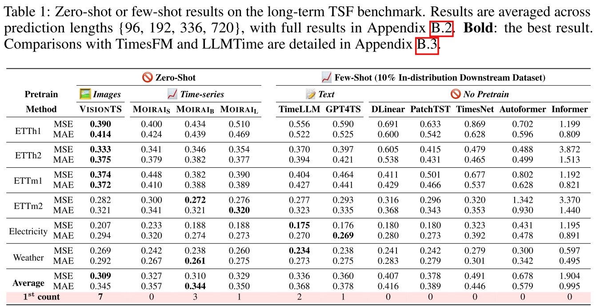
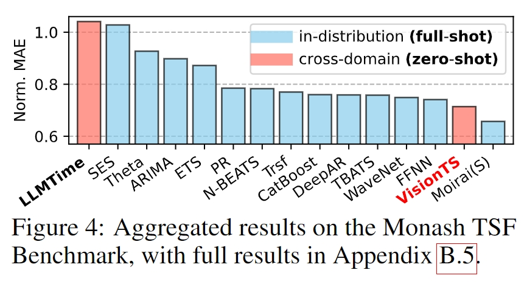

<div align="center">


# VisionTS


_Visual Masked Autoencoders Are Free-Lunch Zero-Shot Time Series Forecasters_

[](https://arxiv.org/abs/2408.17253)
[](https://arxiv.org/abs/2508.04379)
[](#-quick-start)
[![AI horizon forecast](https://img.shields.io/badge/AI_horizon_forecast-black?logo=data%3Aimage%2Fjpeg%3Bbase64%2C%2F9j%2F4AAQSkZJRgABAQAAAQABAAD%2F2wCEAAQEBAQEBAQEBAQGBgUGBggHBwcHCAwJCQkJCQwTDA4MDA4MExEUEA8QFBEeFxUVFx4iHRsdIiolJSo0MjRERFwBBAQEBAQEBAQEBAYGBQYGCAcHBwcIDAkJCQkJDBMMDgwMDgwTERQQDxAUER4XFRUXHiIdGx0iKiUlKjQyNEREXP%2FCABEIADAAMAMBIgACEQEDEQH%2FxAAcAAABBAMBAAAAAAAAAAAAAAAHAAQFBgECCAP%2F2gAIAQEAAAAA4by52aKaakJyNMdZgMxvee73dCJ5%2Bdhg%2BLJ6J2IY7r6SS%2F%2FEABkBAAIDAQAAAAAAAAAAAAAAAAMGAQIEBf%2FaAAgBAhAAAAB33c9jJRYk3%2F%2FEABcBAAMBAAAAAAAAAAAAAAAAAAQFBwD%2F2gAIAQMQAAAATKm88APoWH%2F%2FxAAxEAABAwIEBQEFCQAAAAAAAAABAgMEAAUGERITByExUWEiFEFCUqIjM0NTYnFykZL%2F2gAIAQEAAT8A2vIraqLBXJdS0jmo%2B6pluehull4aVDqDW15FbRp%2B3ux0JcW2dJ5Z0Up%2BWuH0RsS7nd1oBRbYa5Az%2BckIR9Sgax2wJsOyYi0ZKmNuMvkfnsEA%2FSQa0I7GtCOxq28MYF0w6i0XF4x7zdmi5b9ZCUNqTza3Aef2x9Iy6dan4RkWqS9BuKFsSWjkpCyP7HcHuORrDWC02jAL8ua6lp29zUbQcUEExogOfX3KUr6aewUi%2FwCBr5boD6HZVuebuLKW1BatsDbeAA%2FcE%2Fxo2EglBfGoHIjlnTXC2%2BRrMm9vNJ0LaD4aK07oZJ0h0oz1BBPRXSm%2BNl6dmh5y%2BXVAKwfvTo%2FyFVd8W4uvU%2B3XbDlykyoVyKNKGnFOIYkdHGyPgyPNPisW8ULi3PTAi4jc24TLcYuNyigOrQPWv0n4lVhHipcmb5CEu%2FuuR3FbTmuTuBKXBp15EnmnrVvxSbriSTAvFxnQJUJx1U9DKQthaGAVLWkkjbJA8jtVx4vXl%2B5vzI7iGmiopS0G0FIa6BBBHMZVun56t2J7nbY78eLOeabeTodS2spC09ld6cmuOKKtymZy21JUHOhFT%2BIcqVZ%2FYk7aZDjSGX5KU5POtN5FKFKozFq%2FENbvmt39Vb3mt3zW7W95r%2F%2FEACURAAEEAQMDBQEAAAAAAAAAAAECAxESAAQFIRQxUSJCQ3GBof%2FaAAgBAgEBPwBWjoaqEHBtjR0Re%2BSf4M6UYlC3nrOpZcBSfefSR%2BZTVdEtIaZsSVBNzMTNe3jEadRWlLWlbEJsoqWY57AEY3uRaMoXBwbkoG1%2BfvHd4cdiTEeOM%2F%2FEACQRAAIBBAEDBQEAAAAAAAAAAAECAwAEERIFEyEjFDFRYnGR%2F9oACAEDAQE%2FAFuA42U5FNyzjlEtNfGRjb7kZxXWNRXfIcYHWZZAHcsNgAP7k009016L7z9PcPnUdiBjNPz19Musaup2HbAJZSPepbGOZdZUDD4IBr0SFdNFxVtw9taKywx4DEk%2Fpr%2F%2F2Q%3D%3D)](https://aihorizonforecast.substack.com/p/visionts-building-high-performance)
[](https://mp.weixin.qq.com/s/vTPkbu5ANYBGO4KYKZfAyg)

</div>

<p align="center">
    🔍&nbsp;<a href="#-about">About</a>
    | 🚀&nbsp;<a href="#-quick-start">Quick Start</a>
    | 📊&nbsp;<a href="#-evaluation">Evaluation</a>
    | 🔗&nbsp;<a href="#-citation">Citation</a>
</p>

## 🎉 What's New

- 🔥 Aug 2025: We released [VisionTS++](https://arxiv.org/abs/2508.04379), a SOTA time series foundation model by continual pretraining visual MAE on large-scale time series data, supporting multi-channel forecasting and probablistic forecasting!

- May 2025: Our paper is accepted by ICML 2025!

- Nov 2024: VisionTS achieved the **#1** rank 🏆 for zero-shot point forecasting (MASE) on [GIFT-EVAL](https://huggingface.co/spaces/Salesforce/GIFT-Eval) (as of Nov 2024, surpassing Moirai, TimesFM, chronos, etc) — **without any time series training**!

## 🔍 About


- We propose **VisionTS**, a time series forecasting (TSF) foundation model building from rich, high-quality *natural images* 🖼️. 

  - This is conceptually different from the existing TSF foundation models (*text-based* 📝 or *time series-based* 📈), but it shows a comparable or even better performance **without any adaptation on time series data**.

<div align="center">

</div>

- We reformulate the TSF task as an image reconstruction task, which is further processed by a visual masked autoencoder ([MAE](https://arxiv.org/abs/2111.06377)). 

<div align="center">

</div>

## 🚀 Quick Start

We have uploaded our package to PyPI. Please first install [pytorch](https://pytorch.org/get-started/locally/), then running the following command for installing **VisionTS**:

```bash
pip install visionts
```

Then, you can refer to [demo.ipynb](demo.ipynb) about forecasting time series using **VisionTS**, with a clear visualization of the image reconstruction. 


## 📊 Evaluation

Our repository is built on [Time-Series-Library](https://github.com/thuml/Time-Series-Library), [MAE](https://github.com/facebookresearch/mae), and [GluonTS](https://github.com/awslabs/gluonts). Please install the dependencies through `requirements.txt` before running the evaluation.

#### Long-Term TSF Benchmarks (Zero-Shot)

<div align="center">

</div>


We evaluate our methods on 6 long-term TSF benchmarks for zero-shot forecasting. The scripts are under `long_term_tsf/scripts/vision_ts_zeroshot`. Before running, you should first follow the instructions of [Time-Series-Library](https://github.com/thuml/Time-Series-Library) to download datasets into `long_term_tsf/dataset`. Using the following command for reproduction:


```bash
cd long_term_tsf/
bash scripts/vision_ts_zeroshot/$SOME_DATASET.sh
```

#### Monash (Zero-Shot)

<div align="center">

</div>


We evaluate our methods on 29 Monash TSF benchmarks. You can use the following command for reproduction, where the benchmarks will be automatically downloaded.


```bash
cd eval_gluonts/
bash run_monash.sh
```

> [!IMPORTANT]
> The results in the paper are evaluated based on `python==3.8.18`, `torch==1.7.1`, `torchvision==0.8.2`, and `timm==0.3.2`. Different versions may lead to slightly different performance.

#### PF (Zero-Shot)

We evaluate our methods on 6 long-term TSF benchmarks for zero-shot forecasting. Before running, you should first follow the instructions of [Time-Series-Library](https://github.com/thuml/Time-Series-Library) to download datasets into `long_term_tsf/dataset`, in addition to the following three datasets:

- Walmart: https://www.kaggle.com/competitions/walmart-recruiting-store-sales-forecasting/overview (download to `long_term_tsf/dataset/walmart-recruiting-store-sales-forecasting/train.csv`)
- Istanbul Traffic: https://www.kaggle.com/datasets/leonardo00/istanbul-traffic-index (download to `long_term_tsf/dataset/istanbul-traffic-index/istanbul_traffic.csv`)
- Turkey Power: https://www.kaggle.com/datasets/dharanikra/electrical-power-demand-in-turkey  (download to `long_term_tsf/dataset/electrical-power-demand-in-turkey/power Generation and consumption.csv`)

You can use the following command for reproduction.

```bash
cd eval_gluonts/
bash run_pf.sh
```

#### Long-Term TSF Benchmarks (Full-Shot)


We evaluate our methods on 8 long-term TSF benchmarks for full-shot forecasting. The scripts are under `long_term_tsf/scripts/vision_ts_fullshot`. Using the following command for reproduction:


```bash
cd long_term_tsf/
bash scripts/vision_ts_fullshot/$SOME_DATASET.sh
```


## 🔗 Citation

```bibtex
@misc{chen2024visionts,
      title={VisionTS: Visual Masked Autoencoders Are Free-Lunch Zero-Shot Time Series Forecasters}, 
      author={Mouxiang Chen and Lefei Shen and Zhuo Li and Xiaoyun Joy Wang and Jianling Sun and Chenghao Liu},
      year={2024},
      eprint={2408.17253},
      archivePrefix={arXiv},
      url={https://arxiv.org/abs/2408.17253}, 
}
```

## ⭐ Star History


<div align="center">
    <a href="https://star-history.com/#Keytoyze/VisionTS&Timeline">
        
    </a>
</div>


