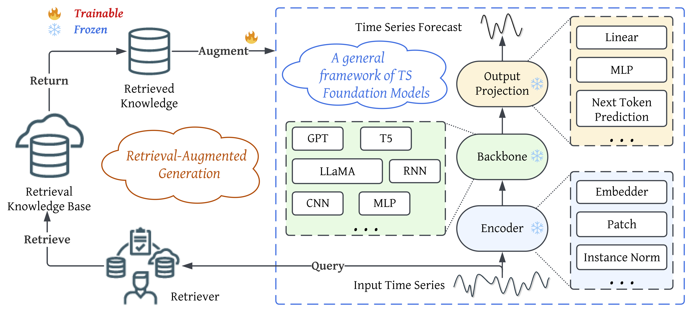
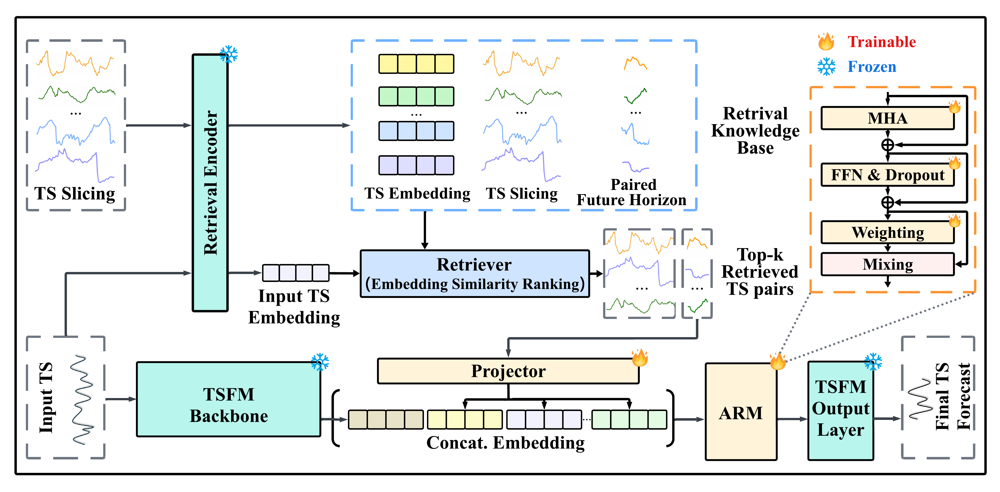

# (NeurIPS 2025) TS-RAG: Retrieval-Augmented Generation based Time Series Foundation Models are Stronger Zero-Shot Forecaster

This is the official repository for "TS-RAG: Retrieval-Augmented Generation based Time Series Foundation Models are Stronger Zero-Shot Forecaster". [Paper](https://arxiv.org/abs/2503.07649)

This repository is maintained by [*Kanghui Ning*](https://kanghui-learning.github.io/) from ***UConn DSIS***.

If you find this resource helpful, please consider to star this repository and cite our research:

```bibtex
@misc{ning2025tsrag,
      title={TS-RAG: Retrieval-Augmented Generation based Time Series Foundation Models are Stronger Zero-Shot Forecaster}, 
      author={Kanghui Ning and Zijie Pan and Yu Liu and Yushan Jiang and James Y. Zhang and Kashif Rasul and Anderson Schneider and Lintao Ma and Yuriy Nevmyvaka and Dongjin Song},
      year={2025},
      eprint={2503.07649},
      archivePrefix={arXiv},
      primaryClass={cs.LG},
      url={https://arxiv.org/abs/2503.07649}, 
}
```

## Introduction

TS-RAG is a retrieval-augmented generation framework for time series forecasting that enhances the generalization and interpretability of Time Series Foundation Models(TSFMs).



The proposed TS-RAG consists of three key components, i.e., a time series foundation model, a retriever, and a learnable Adaptive Retrieval Mixer (ARM) augmentation module. Given an input series, the retriever finds top-k similar contexts and their future horizons from a knowledge base. These horizons are embedded and combined with the input through the ARM, which adaptively assigns importance scores. The unified representation is then passed to the foundation model’s output layer to produce enhanced forecasts.



## Installation

1. **Create a new conda environment**:
   ```bash
   conda create -n tsrag python=3.9
   ```
2. **Activate the environment**:
   ```bash
   conda activate tsrag
   ```
3. **Install requirements**:
   ```bash
   pip install -r requirements.txt
   ```
4. **Navigate to the TS-RAG directory**:
   ```bash
   cd TS-RAG
   ```

## Data & Model Download

You can download our preprocessed datasets and pretrained models from [Google Drive](https://drive.google.com/drive/folders/12wesXfVwFhdrUY5Kv8yuAWWqN9M77irw?usp=sharing) and [Huggingface](https://huggingface.co/nkh/TS-RAG-Data):

## File Structure
After downloading the datasets and code, your file structure should look like this:

```
.
├── datasets
│   ├── ETT-small
│   └── weather
├── retrieval_database
├── TS-RAG
│   ├── models
│   ├── results
│   │   └── forecast_evaluation
│   └── checkpoints
│       ├── base
│       ├── chronos-bolt
```

## Usage

- To run TS-RAG with **chronos-bolt** as the backbone:

  ```bash
  bash script/zeroshot_chronos.sh
  ```

## Further Reading

1. [Multi-modal Time Series Analysis: A Tutorial and Survey](https://dl.acm.org/doi/abs/10.1145/3711896.3736567), in KDD 2025

> Authors: Yushan Jiang, Kanghui Ning, Zijie Pan, Xuyang Shen, Jingchao Ni, Wenchao Yu, Anderson Schneider, Haifeng Chen, Yuriy Nevmyvaka, Dongjin Song

```bibtex
@inproceedings{10.1145/3711896.3736567,
author = {Jiang, Yushan and Ning, Kanghui and Pan, Zijie and Shen, Xuyang and Ni, Jingchao and Yu, Wenchao and Schneider, Anderson and Chen, Haifeng and Nevmyvaka, Yuriy and Song, Dongjin},
title = {Multi-modal Time Series Analysis: A Tutorial and Survey},
year = {2025},
booktitle = {Proceedings of the 31st ACM SIGKDD Conference on Knowledge Discovery and Data Mining V.2},
series = {KDD '25}
}
```

2. [Explainable multi-modal time series prediction with llm-in-the-loop](https://arxiv.org/abs/2503.01013), in NeurIPS 2025

> Authors: Yushan Jiang, Wenchao Yu, Geon Lee, Dongjin Song, Kijung Shin, Wei Cheng, Yanchi Liu, Haifeng Chen

```bibtex
@misc{jiang2025explainablemultimodaltimeseries,
      title={Explainable Multi-modal Time Series Prediction with LLM-in-the-Loop}, 
      author={Yushan Jiang and Wenchao Yu and Geon Lee and Dongjin Song and Kijung Shin and Wei Cheng and Yanchi Liu and Haifeng Chen},
      year={2025},
      eprint={2503.01013},
      archivePrefix={arXiv},
      primaryClass={cs.LG},
      url={https://arxiv.org/abs/2503.01013}, 
}
```

3. [Harnessing Vision Models for Time Series Analysis: A Survey](https://arxiv.org/abs/2502.08869), in IJCAI 2025

> Authors: Jingchao Ni, Ziming Zhao, ChengAo Shen, Hanghang Tong, Dongjin Song, Wei Cheng, Dongsheng Luo, Haifeng Chen

```bibtex
@misc{ni2025harnessingvisionmodelstime,
      title={Harnessing Vision Models for Time Series Analysis: A Survey}, 
      author={Jingchao Ni and Ziming Zhao and ChengAo Shen and Hanghang Tong and Dongjin Song and Wei Cheng and Dongsheng Luo and Haifeng Chen},
      year={2025},
      eprint={2502.08869},
      archivePrefix={arXiv},
      primaryClass={cs.LG},
      url={https://arxiv.org/abs/2502.08869}, 
}
```
