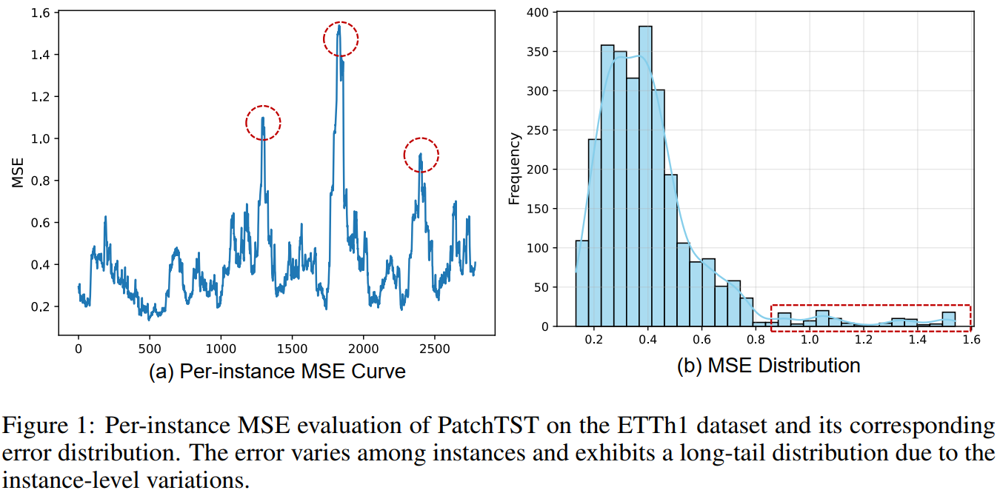
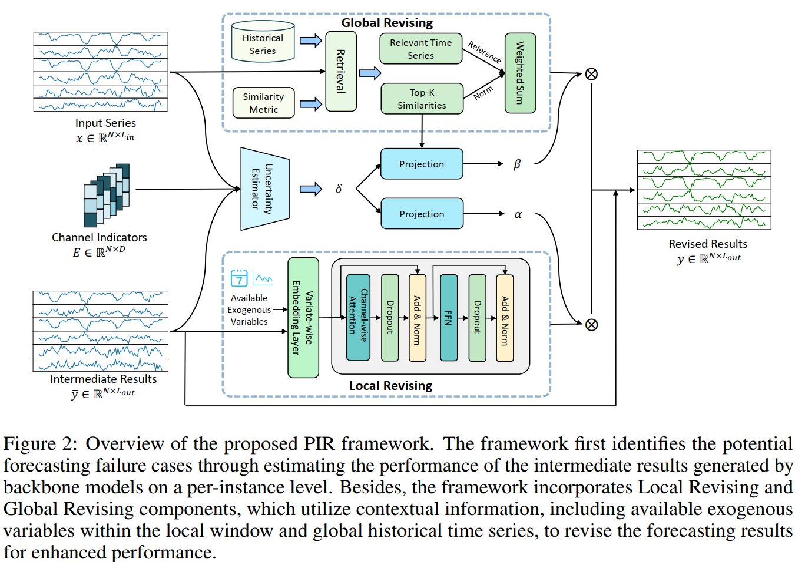
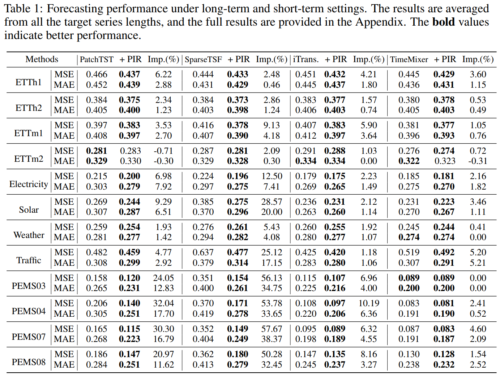
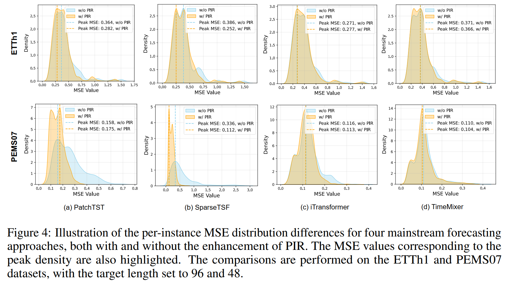

### PIR(NeurIPS 2025)

---

This repo is the official Pytorch implementation of our NeurIPS 2025 paper: Improving Time Series Forecasting via Instance-aware Post-hoc Revision.

#### Introduction

While recent methods have achieved remarkable accuracy by incorporating advanced inductive biases and training strategies, we observe that instance-level variations remain a significant challenge. These variations—stemming from distribution shifts, missing data, and long-tail patterns—often **lead to suboptimal forecasts for specific instances**, even when overall performance appears strong. To address this issue, we propose a model-agnostic framework, **PIR**, designed to enhance forecasting performance through Post-forecasting Identification and Revision. Specifically, PIR first identifies biased forecasting instances by estimating their accuracy. Based on this, the framework revises the forecasts using contextual information, including covariates and historical time series, from both local and global perspectives in a post-processing fashion.   

##### Motivation Illustration



##### Framework Overview

- **Failure Identification**: We first identify the potential biased forecasting instances where the model’s predictions are less reliable, through **estimating the forecasting performance** on a per-instance level.  
- **Local Revision**: We utilize **immediate forecasts** of covariates along with **available exogenous information** as side information to implicitly mitigate the impact of instance-level variations within a local window. 
- **Global Revision**: We introduce the **retrieval-based strategy** to better capture long-tail patterns that may be overlooked by conventional forecasting models .



#### Experiments

We conduct extensive experiments on well-established real-world datasets, covering both long-term and short-term forecasting settings with mainstream models. The results demonstrate that the PIR framework consistently enhances forecasting accuracy, leading to more reliable and robust performance.  

##### Main Results



##### Per-instance Analysis



#### Usage

##### Environment and dataset setup

This repo is built on the pioneer works ([Time-Series-Library](https://github.com/thuml/Time-Series-Library)). The environment requirements and datasets can be found in their original repo. Many thanks to their efforts and devotion!

##### Running

We provide ready-to-use scripts for PIR enhanced backbone models.

```sh
sh scripts/{backbone}/{dataset}.sh # pretrain backbone forecaster on a certain dataset.
sh scripts/{backbone}/PIR/{dataset}.sh # enhancing the forecasting performance with PIR.
```

