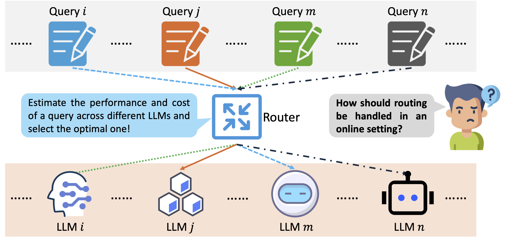
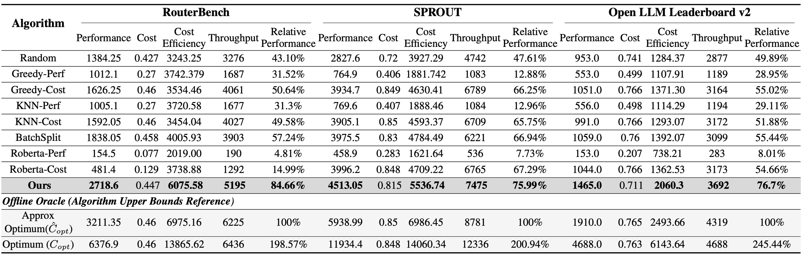
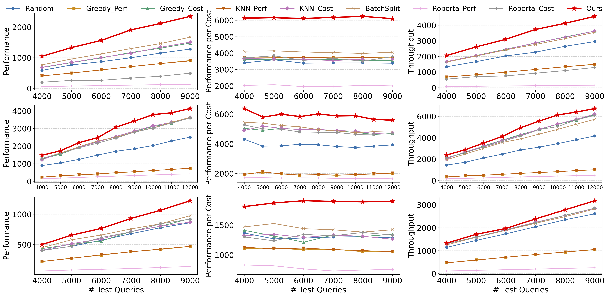
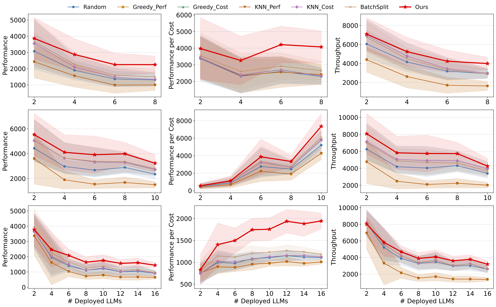

# PORT: Efficient Training-Free Online Routing for High-Volume Multi-LLM Serving


 


## Introduction
Increasing demand for Large Language Models (LLMs) services imposes substantial deployment and computation costs on providers. LLM routing offers a cost-efficient solution by directing queries to the optimal LLM based on model and query features. However, existing works primarily focus on offline scenarios and struggle to adapt to online settings with high query volume and constrained token budgets. In this work, we introduce the first training-free algorithm for online routing scenarios. Our algorithm leverages approximate nearest neighbor search to efficiently estimate query features and performs a one-time optimization over a small set of initial queries to learn a routing strategy that guides future routing. We provide theoretical guarantees demonstrating that our algorithm achieves a competitive ratio of $1 - o(1)$ under natural assumptions, which is further validated by extensive experiments across 3 benchmark datasets and 8 baselines, showing an average improvement of **3.55×** in overall performance, **1.85×** in cost efficiency, and nearly **4.25×** in throughput. More information can be found [here](docs/slides_introduction.pdf).



## Updates
- [2025.8.15] 🚀 Our code is released!


## Requirements

Clone this repo and install the dependencies with:

```bash
git clone https://github.com/fzwark/PORT.git
cd PORT
pip install -r requirements.txt
```

## Running

To reproduce the main results for on [RouterBench](https://huggingface.co/datasets/withmartian/routerbench), a large-scale benchmark of 30k+ prompts and 11 LLMs designed to evaluate LLM routing, run:

```bash
python test.py --ops 1 2 3 4 5 6 7 8 --N=10000 --M=11 --E=26497 --alpha=0.0001 --eps=0.025 --budget=1 --split=weighted --embed=bge
```

- You can specify the routing methods from our paper using the `ops` option.
- Use `N` to set the size of the test query volume. You can also adjust `E` to control the number of historical data points used, and `M` to control the number of deployed LLMs.
- The parameters of our online routing algorithm can be adjusted via `alpha` (a control parameter) and `eps` (the fraction of initial queries used for one-time optimization).
- The `split` option determines how the budget is allocated across deployed LLMs. We provide six splitting strategies: `"weighted"`, `"extreme"`, `"random"`, `"uniform"`, `"cost"`, and `"perf"`.
- The `embed` option specifies the embedding model to be used.

### Integrating a New Benchmark

To add a new benchmark into this framework, the dataset must follow a unified schema. Each sample represents a single query, and for that query the dataset should include following fields from every supported LLM `m`:

- `index`: A unique identifier for the query.
- `prompt`: The input text (string).
- `m`: The model’s performance score (value in \[0, 1]).
- `m|total_cost`: The model’s total inference cost (float) for the query.


### Model Training for Model-Based Router Baselines

To train the models used in the model-based baselines, run:

```bash
python train.py --dataset routerbench
```


## Results

### Main Results
Extensive experiments on three benchmarks demonstrate that our algorithm consistently outperforms all eight baselines across performance, cost efficiency, and throughput. As shown in the table below, our algorithm outperforms all baselines on average by **3.55×** in performance, **1.85×** in cost efficiency, and nearly **4.25×** in throughput. 



### Query Volume 
We vary query volume from 4000 to 12000 and observe that our algorithm consistently outperforms all baselines, maintaining top performance and robustness as load increases.





### Scalability to LLM Deployments
Our method consistently outperforms training-free baselines under diverse LLM deployment configurations (ranging from 2 LLMs to 16 LLMs), highlighting its robustness and adaptability.




## Citation

If you use this codebase, please consider citing our paper:

```bibtex
@inproceedings{
wu2025efficient,
title={Efficient Training-Free Online Routing for High-Volume Multi-{LLM} Serving},
author={Fangzhou Wu and Sandeep Silwal},
booktitle={The Thirty-ninth Annual Conference on Neural Information Processing Systems},
year={2025},
url={https://openreview.net/forum?id=d4mZyZB5I9}
}
```
