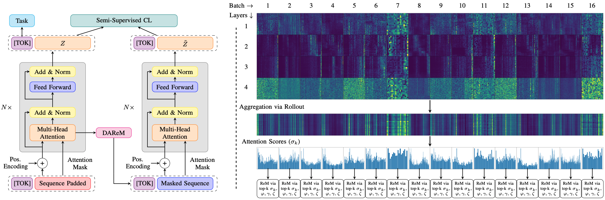

# 📝 STaRFormer: Semi-Supervised Task-Informed Representation Learning via Dynamic Attention-Based Regional Masking for Sequential Data

This repository is the official implementation of [[NeurIPS-2025] STaRFormer: Semi-Supervised Task-Informed Representation Learning via Dynamic Attention-Based Regional Masking for Sequential DataSequential Data](https://neurips.cc/virtual/2025/poster/116860). Check out the official [Project Page](https://star-former.github.io/) for more information.

**Note**: We are sadly unable to publish all relevant code to the BMW DKT dataset.

## 🎯 Overview
We try to adress real-world scenarios of time-series modelling, where environmental factors and signal measurement limitations result in non-stationary and irregularly sampled data, posing challenges. To
address this, we developed a transformer-based framework designed for sequential data tasks, which also serves as an augmentation mechanism
and can serve as a universal framework for time-series modeling. Our method employs a novel ”dynamical attention-based regional masking”
scheme combined with semi-supervised contrastive learning to enhance task-specific latent representations. We validated our approach on 15 datasets varying in domains, composition, sequence lengths, training samples, and application, demonstrating its efficacy and variability.




## 📋 Requirements

The packages required to run this library, for `GPU`-accelerated hardware, are provided in `requirements_cuda_py3.10.14`.

We recommend to use:
- [pyenv](https://github.com/pyenv/pyenv) and [pyenv-virtualenv](https://github.com/pyenv/pyenv-virtualenv) to handle and setup the virtual environment, and
- Python 3.10.14, as we have tested all packages to be compatible with Python 3.10.14.

### Setup Process:
Using `pyenv`, install Python 3.10.14.

```
pyenv install 3.10.4
```
Use `pyenv-virtualenv` to create a virtual environment

```
pyenv virtualenv 3.10.14 starformer-py3.10.14
```
Then active the environment 

```
pyenv activate starformer-py3.10.14
```
and install the requirements.

```
pip install -r requirements_cuda_py3.10.14.txt
```

## 🏋️‍♂️ Training

To reproduce the experiments in the paper, you can execute the following.
The default logger is set to tensorbard, adjust to `config` files to use, for example, [Weights&Biases](https://wandb.ai/site/) or [MLfLow](https://mlflow.org/) for logging.

### 🗄️ Classification

1. Geolife
```
CUDA_VISIBLE_DEVICES=0 python scripts/training/train.py +experiment=benchmark/classification/geolife.yaml

```
2. P19
```
CUDA_VISIBLE_DEVICES=0 python scripts/training/train.py +experiment=benchmark/classification/p19.yaml

```
3. P12
```
CUDA_VISIBLE_DEVICES=0 python scripts/training/train.py +experiment=benchmark/classification/p12.yaml

```
4. PAM
```
CUDA_VISIBLE_DEVICES=0 python scripts/training/train.py +experiment=benchmark/classification/pam.yaml

```
5. Datasets from the UEA Benchmark
```
CUDA_VISIBLE_DEVICES=0 python scripts/training/train.py +experiment=benchmark/classification/uea/<dataset>.yaml
```
for example,
```
CUDA_VISIBLE_DEVIVES=0 python scripts/training/train.py  +experiment=benchmark/classification/uea/articularywordrecognition.yaml
```

### 🕵️‍♂️ Anomaly Detection

1. Yahoo
```
CUDA_VISIBLE_DEVICES=0 python scripts/training/train.py +experiment=benchmark/anomaly/yahoo.yaml
```

2. KPI
```
CUDA_VISIBLE_DEVICES=0 python scripts/training/train.py +experiment=benchmark/anomaly/kpi.yaml
```

### 📈 Regression
1. Dataset from the TSR benchmark
```
CUDA_VISIBLE_DEVICES=0 python scripts/training/train.py +experiment=benchmark/regression/tsr/<dataset>.yaml
```

### 🧹 Sweeps
You can also run new sweeps. However, the current setup requires the use of [Weights&Biases](https://wandb.ai/site/) to execute the sweeps.

#### Note: 
We used [Weights&Biases](https://wandb.ai/site/) to report the results for each run (see [Weights&Biases report](https://wandb.ai/mf-uofg/STaRFormer/reports/STaRFormer--VmlldzoxNDY2Njk3OQ?accessToken=qc2v09qzoebzimmuq4qp0lli5ojwsitynu8ep6aucd333fmki6cbxu0r8j8fj28c)). We removed the account specific configs from the `config` files. If you have an account, add it there. Otherwise, by default, the `tensorboard logger` can be used.

## 🧐 Evaluation and 📊 Results
See the [Project Page](https://star-former.github.io/) or go directly to the [Weights&Biases report](https://wandb.ai/mf-uofg/STaRFormer/reports/STaRFormer--VmlldzoxNDY2Njk3OQ?accessToken=qc2v09qzoebzimmuq4qp0lli5ojwsitynu8ep6aucd333fmki6cbxu0r8j8fj28c) for more details.

## 🤝 Contributing
All contributions are welcome! All content in this repository is licensed under the MIT license.
