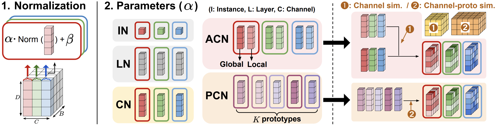

# Channel Normalization for Time Series Channel Identification

### Seunghan Lee, Taeyoung Park*, Kibok Lee*

(*: Equal advising)

<br>

This repository contains the official implementation for the paper ([[Channel Normalization for Time Series Channel Identification](https://arxiv.org/pdf/2506.00432)]) 

This work is accepted in **ICML 2025**

<p align="center">

</p>

<br>

# 1.Preparation
## 1-1.Installation
```bash
pip install -r requirements.txt
```

<br>

## 1-2.Datasets

The datasets can be obtained from [here](https://github.com/wzhwzhwzh0921/S-D-Mamba/releases/download/datasets/S-Mamba_datasets.zip).

<br>

# 2.Train
To run **iTransformer** applied with **channel normalization (CN)**, please run the below code:

```bash
bash /scripts/iTransformer/CN/ETTh1.sh
```

<br>

# 3. Plug-in Methods
Replace (traditional) `LayerNorm` with `ChannelNorm` and `AdaptiveChannelNorm`

  
## (1) Layer Normalization
```python
import torch.nn as nn

class LayerNorm(nn.Module):
    def __init__(self, num_features):
        super().__init__()
        self.norm = nn.LayerNorm(num_features)

    def forward(self, x):
        return self.norm(x)
```


## (2) Channel Normalization (Proposed)
```python
class ChannelNorm(nn.Module):
    def __init__(self, num_channels, num_features, eps=1e-5):
        super().__init__()
        self.weight = nn.Parameter(torch.ones(num_channels, num_features))
        self.bias = nn.Parameter(torch.zeros(num_channels, num_features))
        self.eps = eps

    def forward(self, x):
        mean = x.mean(dim=-1, keepdim=True)
        var = x.var(dim=-1, keepdim=True, unbiased=False)
        x_norm = (x - mean) / torch.sqrt(var + self.eps)
        return x_norm * self.weight + self.bias
```


## (3) Adaptive Channel Normalization (Proposed)
```python
class SimilarityWeightedAverage(nn.Module):
    def __init__(self, C, D, temperature):
        super().__init__()
        self.weight = nn.Parameter(torch.ones(C, D))
        self.bias = nn.Parameter(torch.zeros(C, D))
        self.weight_global = nn.Parameter(torch.ones(C, D))
        self.bias_global = nn.Parameter(torch.ones(C, D))
        self.temperature = temperature

    def forward(self, x):
        input_norm = x / x.norm(dim=-1, keepdim=True)
        cosine_similarity = torch.matmul(input_norm, input_norm.transpose(1, 2))
        attn_weights = torch.softmax(cosine_similarity / self.temperature, dim=-1)

        weight_expanded = self.weight.unsqueeze(0).expand(x.size(0), -1, -1)
        bias_expanded = self.bias.unsqueeze(0).expand(x.size(0), -1, -1)

        avg_weight = torch.matmul(attn_weights, weight_expanded) * self.weight_global.unsqueeze(0)
        avg_bias = torch.matmul(attn_weights, bias_expanded) * self.bias_global.unsqueeze(0)

        return x * avg_weight + avg_bias

class AdaptiveChannelNorm(nn.Module):
    def __init__(self, num_channels, num_features, temperature, eps=1e-5):
        super().__init__()
        self.eps = eps
        self.weighted_norm = SimilarityWeightedAverage(num_channels, num_features, temperature)

    def forward(self, x):
        mean = x.mean(dim=-1, keepdim=True)
        var = x.var(dim=-1, keepdim=True, unbiased=False)
        x_norm = (x - mean) / torch.sqrt(var + self.eps)
        return self.weighted_norm(x_norm)
```
# Contact

If you have any questions, please contact **seunghan9613@yonsei.ac.kr**

<br>

# Acknowledgement

We appreciate the following github repositories for their valuable code base & datasets:
- [C-LoRA](https://github.com/tongnie/C-LoRA/tree/main)
- [iTransformer](https://github.com/thuml/iTransformer)
- [S-Mamba](https://github.com/wzhwzhwzh0921/S-D-Mamba)
- [RMLP](https://github.com/plumprc/RTSF)
- [TSMixer](https://github.com/ditschuk/pytorch-tsmixer)
