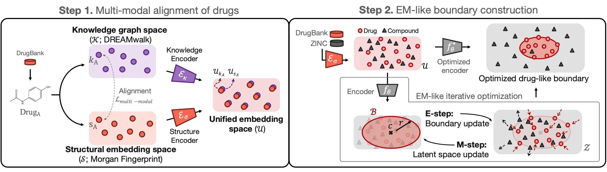

# Official Implementation of BounDr.E in Python

This repository contains the implementation of our paper, *BounDr.E: Predicting Drug-likeness via Biomedical Knowledge Alignment and EM-like One-Class Boundary Optimization*: a novel framework for drug-likeness boundary prediction. Our approach integrates multi-modal alignment between structural and knowledge-based embeddings to enhance the identification of drug-like compounds.
[[ICLR 2025 MLGenX Workshop](https://openreview.net/forum?id=G2zzdbgKxl), [ICML 2025](https://openreview.net/forum?id=Z9Xugry05b)]
### Drug-likeness prediction dataset
The benchmark data, data splits, and external validation sets are provided in [benchmark](benchmark/) folder.

## Model description
Our full framework is two-step;
1. **Multi-modal Mixup of drugs:** The first step aligns the biomedical knowledge graph embedding vectors and Morgan fingerprint vectors into a unified space. 
2. **EM-like boundary construction:** Then, using the structural encoder trained in step 1, we encode all the compounds and drugs into the unified space, then construct the 'drug-likeness boundary' through an EM-like optimization.



## Requirements

To run the code, you will need the following dependencies:
- `pytorch==1.8.1` or above
- `numpy==1.24.1`
- `pandas==2.0.1`
- `rdkit==2022.9.5` or above


You can install the dependencies using:
```bash
pip install -r requirements.txt
```

## Inference: predicting drug-likeness
You can perform drug-likeness inference by running the following command. The outputs indicate the relative distance of the input from the center of the drug boundary, divided by the boundary radius (inference value > 1 means the compound is outside the drug boundary).
```bash
python score.py --input_smiles test.smi --output output.csv \
                --project_dir [project_dir] --device cuda:0
```
**Input Descriptions:**\
`--input_smiles`: SMILES format file for compounds to be evaluated.\
`--project_dir`: directory to save and load checkpoint files under projects folder.\
`--output`: name of outputfile

Demo files are provided in the [demo](demo) folder. You can perform test runs using the demo file (`test.smi`) with:
```bash
python score.py --input_smiles demo/test.smi
```
which will save results in `projects/test_run/output.csv`.

## Model Training
Here, we train the multi-modal alignment encoder and the drug-like boundary encoders and save the checkpoint `.pt` files in the project directory.
### Step 1. Knowledge-integrated multi-modal alignment
To train the model with knowledge-guided multi-modal alignment, use the following command:
```bash
python train_multimodal_alignment.py --input_fingerprint drugs_fp.npy --input_knowledgegraph drugs_kg.npy  \
                                    --input_similarity ATC_sim.npy --project_dir [project_dir] \
                                    --device cuda:0 --seed 42
```

**Input Descriptions:**\
`--input_smiles`: SMILES format file for compounds to be evaluated.\
`--input_fingerprint`: Numpy file containing structural fingerprint embeddings.\
`--input_knowledgegraph`: Numpy file containing biomedical knowledge graph embeddings.\
`--input_similarity`: Numpy file containing ATC code similarity matrix for knowledge alignment.\
`--project_dir`: directory to save and load checkpoint files under projects folder.\
`--device`: GPU index/cpu to run the code on\
`--seed`: Random seed, default 42

### Step 2. Drug-Like Boundary Optimization
Using the structural encoder trained in step 1, we encode the structural representation (Morgan fingerprint) into the unified space then perform the EM-like optimization of drug-likeness boundary.

```bash
python train_boundary.py --train_drugs train_drugs.smi --train_compoonds train_comps.smi \
                        --valid_drugs valid_drugs.smi --valid_compounds valid_compounds.smi \
                        --test_drugs test_drugs.smi --test_compounds test_compounds.smi \
                        --project_dir [project_dir] --device cuda:0 --seed 42
```
**Input Descriptions:**\
`--train_drugs`: SMILES format file for drugs in trainset\
`--train_comps`: SMILES format file for compounds (non-drugs) in trainset\
`--valid_drugs`: SMILES format file for drugs in validset\
`--valid_comps`: SMILES format file for compounds (non-drugs) in validset\
`--test_drugs`: SMILES format file for drugs in testset\
`--test_comps`: SMILES format file for compounds (non-drugs) in testset\
`--project_dir`: directory to save and load checkpoint files under projects folder.

Demo files are provided in the [demo](demo) folder. You can perform test runs using the demo files with:
```bash
python train_boundary.py 
```


### License
This project is licensed under the GPL-3.0 License.


### Citation
```
@inproceedings{bang2025predicting,
  title={Predicting Drug-likeness via Biomedical Knowledge Alignment and EM-like One-Class Boundary Optimization},
  author={Bang, Dongmin and Sung, Inyoung and Piao, Yinhua and Lee, Sangseon and Kim, Sun},
  booktitle={ICLR 2025 Workshop on Machine Learning for Genomics Explorations}
}
```